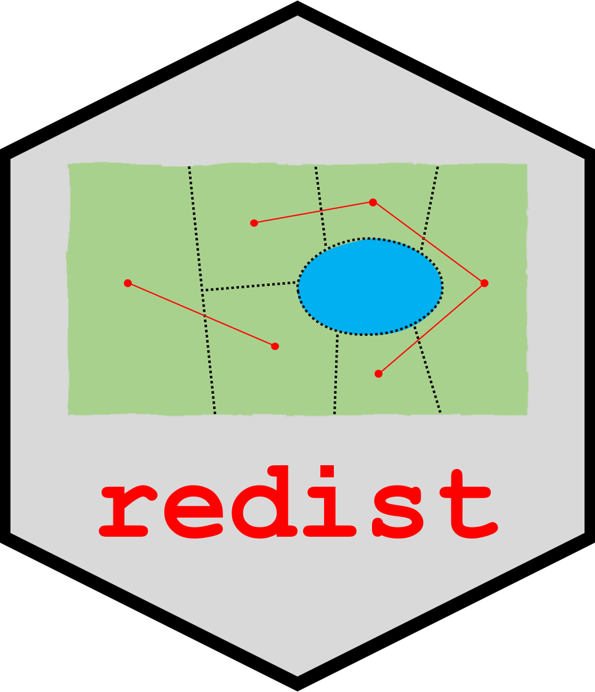

<!-- README.md is generated from README.Rmd. Please edit that file -->

# **redist**: Simulation Methods for Legislative Redistricting

<!-- badges: start -->
[](https://github.com/alarm-redist/redist/actions/workflows/check-standard.yaml)
[](https://cran.r-project.org/package=redist)


<!-- badges: end -->


```{r, echo = FALSE}
knitr::opts_chunk$set(collapse = TRUE, fig.path = "man/figures/README-", comment = "#>")
set.seed(5118)
```



This R package enables researchers to sample redistricting plans from a 
pre-specified target distribution using Sequential Monte Carlo and Markov 
Chain Monte Carlo algorithms. The package supports various constraints in
the redistricting process, such as geographic compactness and population 
parity requirements. Tools for analysis, including computation of various 
summary statistics and plotting functionality, are also included.

Authors:

-   [Christopher T Kenny](https://christophertkenny.com),
    [christopherkenny\@fas.harvard.edu](mailto:christopherkenny@fas.harvard.edu)
    (Maintainer)
-   [Cory McCartan](https://corymccartan.com),
    [cmccartan\@g.harvard.edu](mailto:cmccartan@g.harvard.edu)
-   [Ben Fifield](https://www.benfifield.com),
    [benfifield\@gmail.com](mailto:benfifield@gmail.com)
-   [Kosuke Imai](https://imai.fas.harvard.edu),
    [imai\@harvard.edu](mailto:imai@harvard.edu)

Contributors:

-   Jun Kawahara, [jkawahara\@i.kyoto-u.ac.jp](mailto:jkawahara@i.kyoto-u.ac.jp)
-   Alex Tarr, [atarr\@princeton.edu](mailto:atarr@princeton.edu)
-   [Michael Higgins](https://www.k-state.edu/stats/about/people/HigginsMichael.html),
    [mjh5\@princeton.edu](mailto:mjh5@princeton.edu)

Papers:

- McCartan, C., & Imai, K. (Forthcoming). [Sequential Monte Carlo for sampling balanced and compact redistricting plans](https://arxiv.org/abs/2008.06131/). *Annals of Applied Statistics*.
- Fifield, B., Higgins, M., Imai, K., & Tarr, A. (2020). 
[Automated redistricting simulation using Markov chain Monte Carlo](https://doi.org/10.1080/10618600.2020.1739532). *Journal of Computational and Graphical Statistics*, 29(4), 715-728.
- Fifield, B., Imai, K., Kawahara, J., & Kenny, C. T. (2020). [The essential role of empirical validation in legislative redistricting simulation](https://doi.org/10.1080/2330443X.2020.1791773). *Statistics and Public Policy*, 7(1), 52-68.

## Installation Instructions

`redist` is available on CRAN and can be installed using:

```{r eval = FALSE}
install.packages("redist")
```

You can also install the most recent development version of `redist` 
(which is usually quite stable) using the `remotes` package.

```{r eval=FALSE}
if (!require(remotes)) install.packages("remotes")
remotes::install_github("alarm-redist/redist@dev", dependencies=TRUE)
```

## Getting started

A basic analysis has two steps. First, you define a redistricting plan using
`redist_map`. Then you simulate plans using one of the algorithm functions:
`redist_smc`, `redist_flip`, and `redist_mergesplit`.

```{r message=FALSE}
library(redist)
library(dplyr)

data(iowa)

# set a 0.1% population constraint
iowa_map = redist_map(iowa, existing_plan=cd_2010, pop_tol=0.001, total_pop = pop)
# simulate 500 plans using the SMC algorithm
iowa_plans = redist_smc(iowa_map, nsims=500)
```

After generating plans, you can use `redist`'s plotting functions to study the
geographic and partisan characteristics of the simulated ensemble.

```{r readme-plot}
library(ggplot2)
library(patchwork) # for plotting

redist.plot.plans(iowa_plans, draws=c("cd_2010", "1", "2", "3"), shp=iowa_map)

iowa_plans = iowa_plans %>%
    mutate(Compactness = comp_polsby(pl(), iowa_map),
           `Population deviation` = plan_parity(iowa_map),
           `Democratic vote` = group_frac(iowa_map, dem_08, tot_08))

hist(iowa_plans, `Population deviation`) + hist(iowa_plans, Compactness) +
    plot_layout(guides="collect") +
    plot_annotation(title="Simulated plan characteristics")
redist.plot.scatter(iowa_plans, `Population deviation`, Compactness) +
    labs(title="Population deviation and compactness by plan")

plot(iowa_plans, `Democratic vote`, size=0.5, color_thresh=0.5) +
    scale_color_manual(values=c("black", "tomato2", "dodgerblue")) +
    labs(title="Democratic vote share by district")
```

A more detailed introduction to redistricting methods and the package can be
found in the [Get Started](https://alarm-redist.org/redist/articles/redist.html) 
page. The package [vignettes](https://alarm-redist.org/redist/articles/) 
contain more detailed information and guides to specific workflows.


## About This Branch

Working on adding a more generalized SMC version. Added a PHIL_TESTING_FOLDER where I do my own stuff
