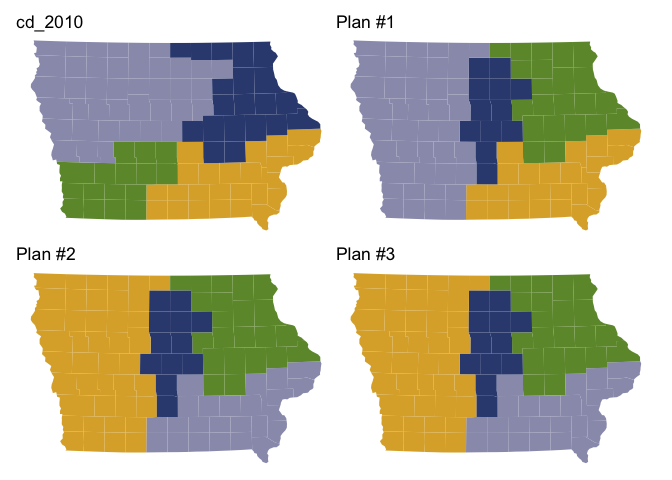
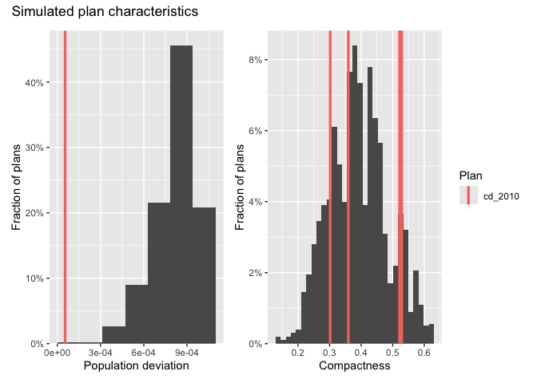
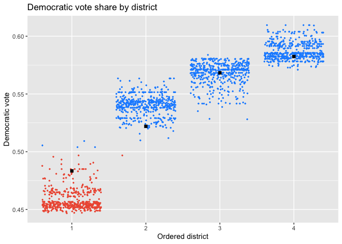

<!-- README.md is generated from README.Rmd. Please edit that file -->

# **redist**: Simulation Methods for Legislative Redistricting

<!-- badges: start -->

[](https://github.com/alarm-redist/redist/actions/workflows/R-CMD-check.yaml)
[](https://cran.r-project.org/package=redist)


<!-- badges: end -->


This R package enables researchers to sample redistricting plans from a
pre-specified target distribution using Sequential Monte Carlo and
Markov Chain Monte Carlo algorithms. The package supports various
constraints in the redistricting process, such as geographic compactness
and population parity requirements. Tools for analysis, including
computation of various summary statistics and plotting functionality,
are also included.

Authors:

- [Christopher T Kenny](https://christophertkenny.com),
  <christopherkenny@fas.harvard.edu> (Maintainer)
- [Cory McCartan](https://corymccartan.com), <cmccartan@g.harvard.edu>
- [Ben Fifield](https://www.benfifield.com), <benfifield@gmail.com>
- [Kosuke Imai](https://imai.fas.harvard.edu), <imai@harvard.edu>

Contributors:

- Jun Kawahara, <jkawahara@i.kyoto-u.ac.jp>
- Alex Tarr, <atarr@princeton.edu>
- [Michael
  Higgins](https://www.k-state.edu/stats/about/people/HigginsMichael.html),
  <mjh5@princeton.edu>

Papers:

- [Automated Redistricting Simulation Using Markov Chain Monte
  Carlo](https://doi.org/10.1080/10618600.2020.1739532) *Journal of
  Computational and Graphical Statistics*
- [The Essential Role of Empirical Validation in Legislative
  Redistricting
  Simulation](https://doi.org/10.1080/2330443X.2020.1791773) *Statistics
  and Public Policy* Vol. 7, No. 1, pp. 52-68.
- [Sequential Monte Carlo for Sampling Balanced and Compact
  Redistricting Plans](https://arxiv.org/pdf/2008.06131.pdf)

## Installation Instructions

`redist` is available on CRAN and can be installed using:

``` r
install.packages("redist")
```

You can also install the most recent development version of `redist`
(which is usually quite stable) using the \`remotes\`\` package.

``` r
if (!require(remotes)) install.packages("remotes")
remotes::install_github("alarm-redist/redist@dev", dependencies=TRUE)
```

## Getting started

A basic analysis has two steps. First, you define a redistricting plan
using `redist_map`. Then you simulate plans using one of the algorithm
functions: `redist_smc`, `redist_flip`, and `redist_mergesplit`.

``` r
library(redist)
library(dplyr)

data(iowa)

# set a 0.1% population constraint
iowa_map = redist_map(iowa, existing_plan=cd_2010, pop_tol=0.001, total_pop = pop)
# simulate 500 plans using the SMC algorithm
iowa_plans = redist_smc(iowa_map, nsims=500)
#> SEQUENTIAL MONTE CARLO
#> Sampling 500 99-unit maps with 4 districts and population between 760827 and 762350.
```

After generating plans, you can use `redist`’s plotting functions to
study the geographic and partisan characteristics of the simulated
ensemble.

``` r
library(ggplot2)
library(patchwork) # for plotting

redist.plot.plans(iowa_plans, draws=c("cd_2010", "1", "2", "3"), shp=iowa_map)
```

<!-- -->

``` r

iowa_plans = iowa_plans %>%
    mutate(Compactness = distr_compactness(iowa_map),
           `Population deviation` = plan_parity(iowa_map),
           `Democratic vote` = group_frac(iowa_map, dem_08, tot_08))

hist(iowa_plans, `Population deviation`) + hist(iowa_plans, Compactness) +
    plot_layout(guides="collect") +
    plot_annotation(title="Simulated plan characteristics")
```

<!-- -->

``` r
redist.plot.scatter(iowa_plans, `Population deviation`, Compactness) +
    labs(title="Population deviation and compactness by plan")
```

<!-- -->

``` r

plot(iowa_plans, `Democratic vote`, size=0.5, color_thresh=0.5) +
    scale_color_manual(values=c("black", "tomato2", "dodgerblue")) +
    labs(title="Democratic vote share by district")
```

<!-- -->

A more detailed introduction to redistricting methods and the package
can be found in the [Get
Started](https://alarm-redist.org/redist/articles/redist.html) page. The
package [vignettes](https://alarm-redist.org/redist/articles/) contain
more detailed information and guides to specific workflows.
