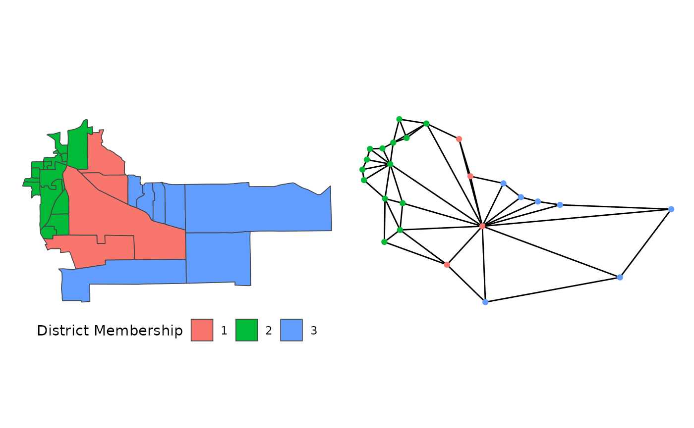
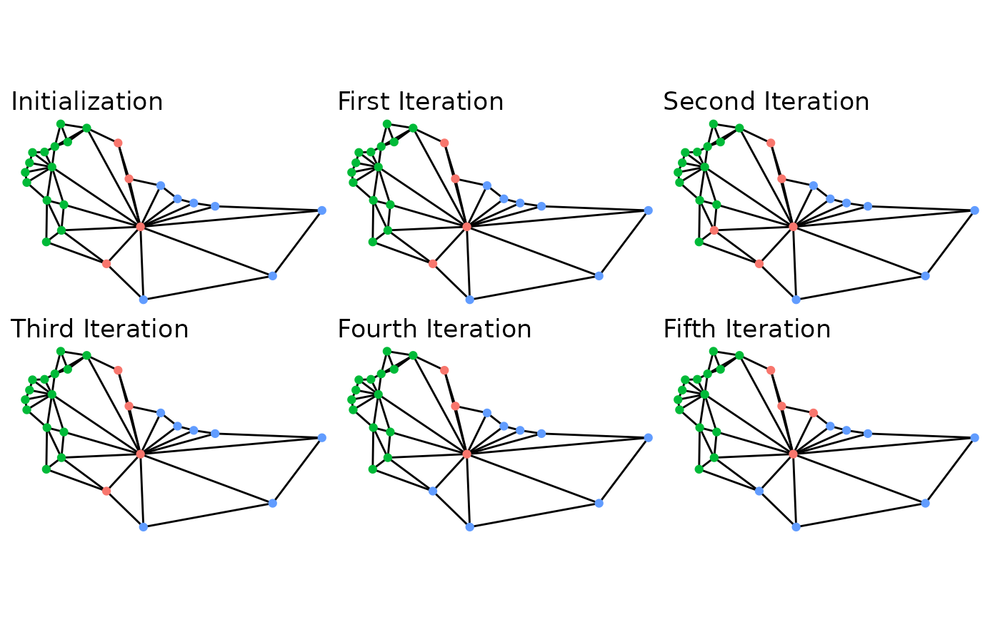
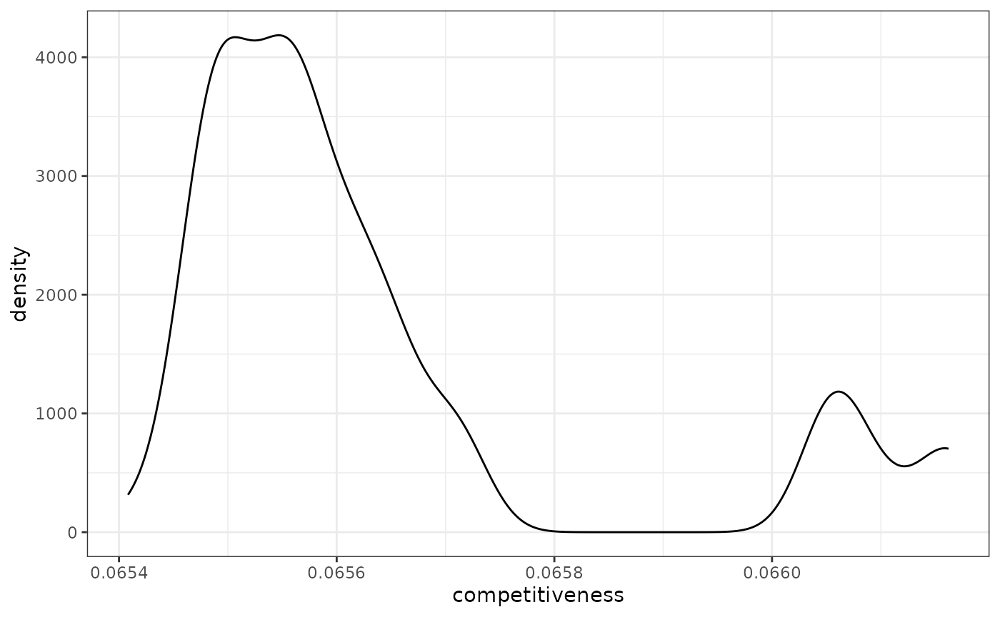
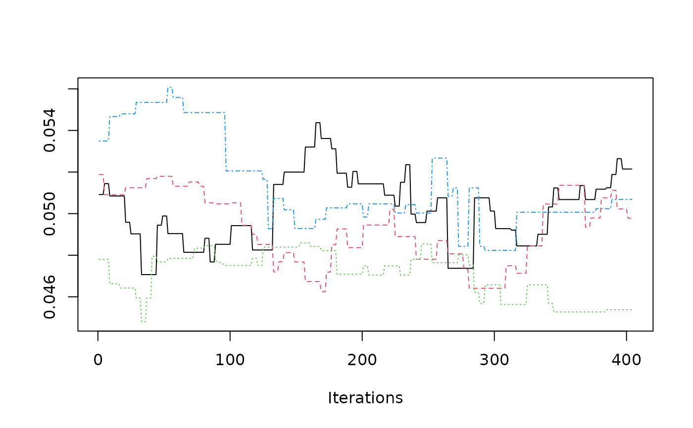
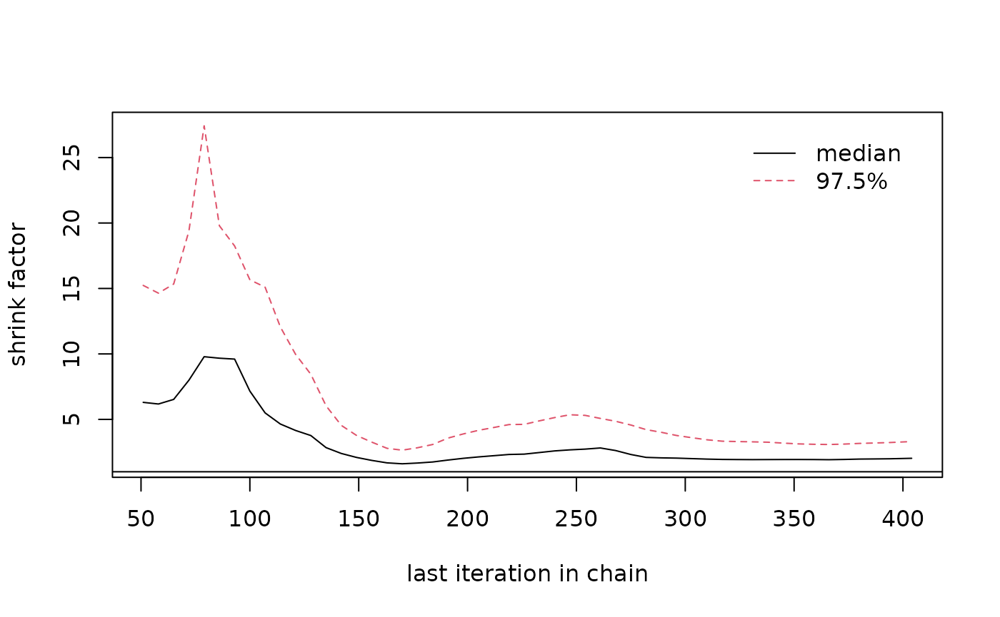
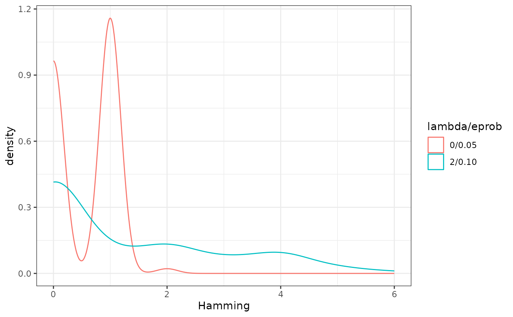

# Redistricting with Flip MCMC

``` r
library(redist)
library(ggplot2)
library(dplyr)
library(patchwork)
# set seed for reproducibility
set.seed(1)
```

The `redist` package is designed to allow for replicable redistricting
simulations. This vignette covers the Flip Markov Chain Monte Carlo
method discussed in: [Automated Redistricting Simulation Using Markov
Chain Monte Carlo](https://doi.org/10.1080/10618600.2020.1739532).

## Table of Contents

- [The Flip MCMC Algorithm](#mcmc)
- [Strengths of Flip](#strengths)
- [Initializing Flip](#init)
- [Redistricting with Flip MCMC](#alg)
- [Using Multiple Chains](#chains)
- [Tidy Flip MCMC using redist_flip()](#flip)
- [Diagnostic Plots](#diag)
- [Tuning Flip Constraints](#tune)
- [Final Thoughts](#final)

## The Flip MCMC Algorithm

``` r
data(fl25)
data(fl25_enum)
plan <- fl25_enum$plans[, 7241]
fl25$plan <- plan
fl_map <- redist_map(fl25, existing_plan = plan, pop_tol = 0.2, total_pop = pop)
#> Projecting to CRS 3857
constr <- redist_constr(fl_map) %>% 
    add_constr_edges_rem(0.02)
set.seed(1)
sims <- redist_flip(map = fl_map, nsims = 6, constraints = constr)
#> 
#> ── redist_flip() ───────────────────────────────────────────────────────────────
#> 
#> ── Automated Redistricting Simulation Using Markov Chain Monte Carlo ──
#> ℹ Preprocessing data.
#> ℹ Starting swMH().
#> ■■■■■■                            17% | ETA:  0s | MH Acceptance: 1.00
#> ■■■■■■■■■■■■■■■■■■■■■■■■■■■■■■■  100% | ETA:  0s | MH Acceptance: 1.00
#> 
```

The `flip` algorithm is one of the more straightforward redistricting
algorithms. Beginning with an initial partition of a graph, it proposes
flipping a node from one partition to an adjacent partition. By checking
that the proposed flip meets basic constraints, such as keeping
partitions contiguous and staying within a certain population parity, it
ensures that all proposed new partitions are also valid partitions. The
implementation within `redist` is a bit more advanced that this, as it
allows for multiple flips and rejecting valid partitions based on a
Metropolis Hastings algorithm. The following walks through the basics of
this algorithm to provide an introduction to using `flip` correctly and
efficiently.



Suppose we are redistricting this small map above on the left. To use
the `flip` algorithm, we need to consider the adjacency graph that
underlies this map, which is above on the right. Each of the 25
precincts on the left are displayed as a node on the right, connected if
they are contiguous on the map. If we use the above district as an
initial plan, we can then run `flip` for a few steps.



While this map is extremely small, the five iterations give a basic idea
of what is going on behind the scenes. At each iteration, it searches
the boundary for possible swaps, selects one, and then accepts or
rejects the proposals. With very weak constraints, like those used to
create the above example, almost every swap is accepted. Even then,
though, it doesn’t guarantee that some iterations won’t repeat other
plans sampled. In fact, in the above, the second iteration is the same
plan as the initialization.

This possibility is very important for ensuring that the sampled plans
are representative of the desired target distribution, which is
controlled by the constraints chosen. The possible constraints are
discussed below, as is information on setting up simulations and some
advice on ensuring that your simulations are efficient.

[Back to top](#top)

## Strengths of Flip

Flip is incredibly powerful for local exploration. If you can make large
changes to a summary statistic of interest without making large changes
to the map itself, this may tell an important story of what went into
making the map.

Flip is one of the easiest to understand algorithms *and* has
theoretical guarantees behind it. This can make it especially useful
when the audience of interest does not have an advanced background in
mathematics or statistics.

Flip has the power to make less compact maps than many other algorithms.
This can be especially powerful when a blind allegiance to compactness
makes otherwise viable plans appear to be outliers.

Our implementation of `flip` has many more Gibbs constraints than our
other implementations. This can allow you to consider different forms of
`partisan` and `countysplit` constraints among others.

However, with these strengths do come weaknesses. Like most Markov Chain
Monte Carlo methods, convergence can’t be shown, it can only be
suggested. Diagnostics, like those in the [section on diagnostic
plots](#diag), can help ensure that convergence is likely, but can never
show that it has indeed happened. Additionally, `flip` makes relatively
small moves per iteration, so many more iterations are needed to move
around the space. If your map is particularly large, you may require
several hundred iterations to make the map substantively different,
which leads to `thinning` the chain, which is dropping many sequential
iterations. However, `thinning` doesn’t make the algorithm more
efficient, so you still need to work through those plans, which comes
with a time cost.

## Initializing Flip

One of the keys to ensuring good performance is the choice of
initialization. In some cases, a starting point may be obvious, such as
when you want to explore the local area around an existing map. If
that’s the use case, then it is straightforward to use that plan as the
starting point. However, if the goal is to understand the larger space
of possibilities, then starting from just one map can be misleading.
Why? Since constraint tuning is not a perfect science, you could be
setting the constraints too strong and, if that map is very good on some
dimension, the `flip` algorithm may have difficulty getting away from
that point without a very large number of iterations.

Our implementation defaults to using the Sequential Monte Carlo (SMC)
algorithm via
[`redist_smc()`](http://alarm-redist.org/redist/reference/redist_smc.md)
to create an initial partition of the districts, if no district is
provided.

While the implementations of Random Seed and Grow (`RSG`) and Compact
Random Seed and Grow (`CRSG`) via
[`redist.rsg()`](http://alarm-redist.org/redist/reference/redist.rsg.md)
and `redist.crsg` do not sample from a defined target distribution, they
can serve as *useful* initializations for `flip` as they help provide a
more diverse set of starting states. `SMC` is often faster and provides
more theoretical guarantees, but tends to sample very compact districts,
even when decreasing the compactness constraint. As such, when trying to
decide if chains have likely converged or not, it can be misleading to
only check chains that start from very compact states.

## Redistricting with Flip MCMC

With the basics of what the `flip` algorithm is doing down, we can
proceed into how to use the algorithm.

To begin running the MCMC algorithm, we have to provide some basic
information, typically beginning with a shapefile. The below loads an
Iowa dataset included within the `redist` package and plots the actual
congressional districts from 2012-2021. (Iowa is a favorite choice for
redistricting simulation examples, as it requires keeping counties
together in plans which allows us to use the counties as the unit for
redistricting, rather than thousands of precincts.)

``` r
data(iowa)
redist.plot.map(iowa, plan = cd_2010)
```


``` r
map_ia <- redist_map(iowa, existing_plan = cd_2010, pop_tol = 0.05)
```

From there, we need to build an adjacency graph which identifies which
counties are touching which other counties on a map. If you have an
existing plan, it’s generally advised to supply this to the optional
`plan` argument to ensure that the existing plan is a valid, connected
plan. If you get a warning, the [geomander R
package](https://christophertkenny.com/geomander/) can help solve
potential issues.

In addition, we need population for each unit. We’ve included `iowa$pop`
as the total population as of the 2010 Census. From there, we have the
basic information that we need to run our first simulation. The below
indicates that we are simulating 1000 plans (with `nsims`) for the state
of Iowa that have at most a population parity deviation of 0.05 (with
`pop_tol`).

``` r
sims <- redist_flip(map_ia, nsims = 100)
#> 
#> ── redist_flip() ───────────────────────────────────────────────────────────────
#> 
#> ── Automated Redistricting Simulation Using Markov Chain Monte Carlo ──
#> ℹ Preprocessing data.
#> ℹ Starting swMH().
#> ■                                  1% | ETA: 0s
#> ■■■■■■■■■■■■■■■■■■■■■■■■■■■■■■■  100% | ETA:  0s | MH Acceptance: 0.65
#> 
```

The printed output can be silenced by setting `verbose = FALSE`, however
it displays very important information. First, it displays when
preprocessing begins and when the algorithm actually starts. Each 10% of
the way through the `flip` algorithm, it outputs the current estimated
Metropolis acceptance. Here, we’ve specified no Gibbs constraints, so
the acceptance will always be near 100%.

The output is an object of class `redist`.

``` r
class(sims)
#> [1] "redist_plans" "tbl_df"       "tbl"          "data.frame"
```

The `sims` object includes various pieces of information that were
tracked while simulating, but we focus on `get_plans_matrix(sims)`,
which is a matrix that contains the plans.

``` r
dim(get_plans_matrix(sims))
#> [1]  99 101
```

Checking the dimensions shows that each plan is saved as a column, where
each row is a precinct. From this, we can extract a single plan as we
would from a normal matrix, like below, where we plot the final
simulated plan.

``` r
redist.plot.map(shp = iowa, plan = get_plans_matrix(sims)[, 100])
```


Now, this plan is incredibly non-compact, which can be an issue.
However, we should expect this type of outcome, as we didn’t include a
compactness constraint while simulating. Thus, the only things checked
were contiguity and that no plan would be outside of the `pop_tol` set
above. Since there are many more non-compact plans than compact plans in
the space of all redistricting plans, we end up with highly non-compact
districts. We can fix this by specifying a constraint, as below:

``` r
constr <- redist_constr(map_ia) %>% add_constr_edges_rem(0.4)

sims_comp <- redist_flip(map_ia, nsims = 100, constraints = constr)
#> 
#> ── redist_flip() ───────────────────────────────────────────────────────────────
#> 
#> ── Automated Redistricting Simulation Using Markov Chain Monte Carlo ──
#> ℹ Preprocessing data.
#> ℹ Starting swMH().
```

The first arguments as the same, but this adds three key arguments.
First, setting `constraint` to any combination of the nine implemented
constraints allows us to specify the target distribution. Setting
`constraintweights = 0.4` means that we want to put a relatively weak
weight on the compactness, though a weak constraint still does a lot of
work. There are four `compact` constraints implemented currently. The
recommended is to use `edges-removed` because it can be calculated very
quickly.

If we plot the final map sampled from the above code, we can see that it
is *far more* compact.

``` r
redist.plot.map(shp = iowa, plan = get_plans_matrix(sims_comp)[, 100])
```


[Back to top](#top)

## Using Multiple Chains

When running larger redistricting analyses, one important step is to run
multiple chains of the MCMC algorithm. This will also allow us to
diagnose convergence better, using the Gelman-Rubin plot, as seen in the
section on [Diagnostic Plots](#diag).

On Windows and in smaller capacities, it is useful to run the algorithm
within an `lapply` loop. First, we set up the seed for replicability and
decide on the number of chains and simulations.

``` r
set.seed(1)
nchains <- 4
nsims <- 100
```

Here, we opt to initialize using the `SMC` algorithm. When we want to
initialize without providing an initial partition, we need to specify
the number of districts, `ndists`.

``` r
constr <- redist_constr(map_ia) %>% add_constr_edges_rem(0.4)
map_ia <- redist_map(iowa, ndists = 4, pop_tol = 0.05)
flip_chains <- lapply(1:nchains, function(x){
  redist_flip(map_ia, nsims = nsims,
              constraints = constr, verbose = FALSE)
})
```

In Unix-based systems, this can be run considerably faster by running
this in parallel.

``` r
mcmc_chains <- parallel::mclapply(1:nchains, function(x){
  redist_flip(map_ia, nsims = nsims,
              constraints = constr, verbose = FALSE)
}, mc.set.seed = 1, mc.cores = parallel::detectCores())
```

[Back to top](#top)

## Tidy Flip MCMC using `redist_flip()`

The new, tidy interface to functions with `redist` introduces a pair of
key objects, `redist_map` and `redist_plans`. The [Get Started
page](http://alarm-redist.org/redist/articles/redist.md) goes into depth
about these, but this shows the basics of how to work with the `flip`
algorithm within the newer interface.

As in the standard interface, we need a data set to work with. This
example will also follow with using the included Iowa data.

``` r
data(iowa)
```

Rather than building the adjacency graph manually, here we can set this
up using `redist_map` which will build it an add it as a column.

``` r
iowa_map <- redist_map(iowa, existing_plan = cd_2010, pop_tol=0.01)
```

We set a population tolerance of 1%. While this is generally a good
population parity tolerance for most simulations, be careful when using
the default within `flip`. If your starting partition sits outside of
that population deviation, `flip` may take a **very, very** long time to
find a valid partition to flip.

Now, we can pass the `redist_map` object to `redist_flip` to begin
simulating.

``` r
tidy_sims <- redist_flip(iowa_map, nsims = 100)
#> 
#> ── redist_flip() ───────────────────────────────────────────────────────────────
#> 
#> ── Automated Redistricting Simulation Using Markov Chain Monte Carlo ──
#> ℹ Preprocessing data.
#> ℹ Starting swMH().
#> ■                                  1% | ETA: 0s
#> ■■■■■■■■■■■■■■■■■■■■■■■■■■■■■■■  100% | ETA:  0s | MH Acceptance: 0.80
#> 
```

`redist_flip`’s constraint includes a relatively weak compactness
constraint by default because simulating compact maps is far more
efficient and completely non-compact maps are not super useful for most
purposes.

You can override this by making a blank `redist_constr` object

``` r
cons <- redist_constr(iowa_map)
```

Then, you can pass this to `redist_flip`.

``` r
tidy_sims_no_comp <- redist_flip(iowa_map, nsims = 100, constraints = cons)
#> 
#> ── redist_flip() ───────────────────────────────────────────────────────────────
#> 
#> ── Automated Redistricting Simulation Using Markov Chain Monte Carlo ──
#> ℹ Preprocessing data.
#> ℹ Starting swMH().
```

`redist_flip` outputs a `redist_plans` object.

``` r
class(tidy_sims)
#> [1] "redist_plans" "tbl_df"       "tbl"          "data.frame"
```

To extract the plans, use `get_plans_matrix().`

``` r
plans <- get_plans_matrix(tidy_sims)
```

Alternatively, you can directly use functions on the `redist_plans`
object. For example, if we want to measure the competitiveness of each
plan:

``` r
tidy_sims <- tidy_sims %>% 
  mutate(competitiveness = compet_talisman(pl(), iowa_map, rvote = rep_08, dvote = dem_08))
```

``` r
tidy_sims %>% 
  ggplot(aes(x = competitiveness)) +
  geom_density() + 
  theme_bw()
```



For more information on using `redist_plans` objects, see the [Get
Started page](http://alarm-redist.org/redist/articles/redist.md).

[Back to top](#top)

## Diagnostic Plots

When using the MCMC algorithms, there are various useful diagnostic
plots. The `redist.diagplot` function creates familiar plots by
converting numeric entries into `mcmc` objects to use with `coda`.

We use the dissimilarity index in Massey and Denton 1988 as a summary
statistic for the following examples. This can be computed with
`seg_dissim`. In this case, we create a Republican dissimilarity index.
We can work with two examples, the first is a single vector of the
segregation index, while the second is a list of vectors, with one
vector for each chain.

``` r
seg <- by_plan(seg_dissim(tidy_sims, iowa_map, rep_08, pop))
```

The first three plots only need a single index.

- Autocorrelation Plot

``` r
redist.diagplot(seg, plot = "autocorr")
```


- Density Plot

``` r
redist.diagplot(seg, plot = "densplot")
```


- Mean Plot

``` r
redist.diagplot(seg, plot = "mean")
```


As examples for the next two plots, we can use the example above which
ran 4 chains. This is the same index, but computed for each chain.

``` r
seg_chains <- lapply(1:nchains, function(i) { 
    seg_dissim(flip_chains[[i]], iowa_map, rep_08, pop)
})
```

- Trace Plot

``` r
redist.diagplot(sumstat = seg_chains, plot = "trace")
```



- Gelman Rubin Plot

``` r
redist.diagplot(sumstat = seg_chains, plot = 'gelmanrubin')
```



[Back to top](#top)

## Tuning Flip Constraints

When using the `flip` algorithm, the most important and difficult step
is setting the right constraint weights. While there may be some general
pieces of advice for doing so, no advice can replace working with your
data. The bottom line is that every data set is a bit different. What
works for one state’s redistricting process, with the data specific to
that state at that time may not transfer to another state or
municipality or school district. The general process of finding what
works might be very similar, but getting the right set of constraint
weights and other parameters will vary immensely. Even starting from a
different plan within the same time and place can change the weights
that perform best. Like most things, the key to tuning `flip` is
patience. Going for a full scale simulation without testing some
parameter configurations is likely an inefficient use of time and
computing power.

The following highlights some advice on how to tune `flip` to make it
work for your particular redistricting problem. For the advice, we’ll
use the following example:

``` r
data(iowa)
iowa_map <- redist_map(iowa, existing_plan = cd_2010, pop_tol = 0.02, total_pop = pop)

cons <- redist_constr(iowa_map) %>% 
    add_constr_edges_rem(0.5) %>% 
    add_constr_pop_dev(100)

sims <- redist_flip(map = iowa_map,  nsims = 100)
#> 
#> ── redist_flip() ───────────────────────────────────────────────────────────────
#> 
#> ── Automated Redistricting Simulation Using Markov Chain Monte Carlo ──
#> ℹ Preprocessing data.
#> ℹ Starting swMH().
#> ■                                  1% | ETA: 0s
#> ■■■■■■■■■■■■■■■■■■■■■■■■■■■■■■■  100% | ETA:  0s | MH Acceptance: 0.55
#> 
```

### Acceptance Ratios

One of the first things to check when working with `flip` is the
Metropolis Hastings ratio. It is printed to the console when
`verbose = TRUE`. If you have silenced printing or warnings, the output
saves the Metropolis Hastings decisions. You can check the acceptance
ratio in a `redist_plans` object with

``` r
mean(sims$mhdecisions, na.rm = TRUE)
#> [1] 0.55
```

Reference plans included in the object will not have an `mhdecision`, so
you can remove them with `na.rm = TRUE`.

The goal is to generally have the Metropolis Hastings ratio lie between
20% and 40%. If simulating with only a single parameter, the goal is
generally to be near 40%, while with many parameters, you likely want to
be near 20%. If over the course of many simulations you find yourself
just above or just below, that probably isn’t a problem if the
simulations are in the right probability space.

### `lambda` and `eprob`

`lambda` and `eprob` both control the amount of movement within `flip`.
They can be very powerful things to increase. `lambda` defaults to 0,
while `eprob` defaults to 0.05. Each of these parameters leads to fairly
small movements between sequential iterations of the algorithm.

``` r
sims_new <- redist_flip(map = iowa_map, nsims = 100, constraints = cons, 
                        eprob = 0.10, lambda = 2, verbose = FALSE)
mean(sims_new$mhdecisions, na.rm = TRUE)
#> [1] 0.46
```

In this example, we’ve increased each of these. `lambda = 2`, up from
its default of 0, while `eprob = 0.10`, up from its default of `0.05`.
What’s going on here can characterized fairly well by the Hamming
distance between sequential runs.

``` r
dists <- redist.distances(plans = get_plans_matrix(sims))$Hamming
dists_new <- redist.distances(plans = get_plans_matrix(sims_new))$Hamming
adj_dists <- rep(NA_integer_, 100)
adj_dists_new <- rep(NA_integer_, 100)
for(i in 1:100){
  adj_dists[i] <- dists[i, i + 1]
  adj_dists_new[i] <- dists_new[i, i + 1]
}
tibble(Hamming = c(adj_dists, adj_dists_new), 
       `lambda/eprob` = c(rep('0/0.05', 100), rep('2/0.10', 100))) %>% 
  ggplot() + 
  geom_density(aes(x = Hamming, color = `lambda/eprob`)) + 
  theme_bw()
```



`lambda` controls the number of components swapped between each
iterations, while `eprob` controls the size of the swapped partitions.
Increasing each of this values can be important for increasing the
amount of movement between outputted plans. These can be adjusted
automatically using `adapt_lambda` and `adapt_lambda` when starting a
simulation, though adjusting them manually to fit your problem is better
practice, as it leads to more control over the process.

### Adjusting `pop_tol`

Sometimes a starting map sits in a neighborhood of maps that isn’t very
conducive to using it as a starting point. This is most often
characterized by running a single iteration that runs (seemingly)
forever. A typical fix for this is to weaken the population tolerance
and use a Gibbs constraint to pull the simulations back into the target
range. I’ve done this for the tuning example, even though it’s
unnecessary.

After simulating, if there is a hard constraint to consider, we can
check the parities:

``` r
sims <- sims %>% mutate(par = plan_parity(map = iowa_map))
```

And then we can subset to the correct space.

``` r
sims <- sims %>% filter(par <= 0.01)
```

With the right set of parameters, this will lead to a reasonable set of
simulations. In this case, we end up with about 10% of the simulations
when using a soft constraint, which is not uncommon. In general, you
want to aim for as low as a hard population parity as possible, while
using a strong weight on the Gibbs population when the hard constraint
is above what’s necessary. This helps maximize the efficiency of your
simulations, while allowing for additional movement between
neighborhoods of valid plans.

### Balancing Multiple Constraints

More often than not, there are multiple constraints that are important
to a redistricting problem. There are two general paths to success when
working with more than one or two constraints.

First, you might want to add one at a time, generally starting with the
compactness constraint. If `flip` doesn’t consider compactness at all,
it has an unfortunate behavior of creating incredibly non-compact maps.
However, with even a very weak compactness constraint, it performs very
well in avoiding those maps that are so non-compact that they aren’t
worthy of consideration. Then you can add the next constraints once at a
time, weakening them a bit each time you add a new constraint. As above,
you want to make sure that your acceptance rate is between 20% and 40%.
If it’s too low, you won’t get sufficient movement around the
probability space and if it’s too high, you likely aren’t characterizing
the probability space you want to characterize.

The other way to tune is to run a simulation with a kitchen sink type
set up.

``` r
cons <- redist_constr(iowa_map) %>% 
    add_constr_edges_rem(0.25) %>% 
    add_constr_pop_dev(50) %>% 
    add_constr_compet(10, rvote = rep_08, dvote = dem_08) %>% 
    add_constr_splits(10, admin = region)
```

Then we can run this for a relatively small number of iterations.

``` r
sims <- redist_flip(iowa_map, 100, constraints = cons)
#> 
#> ── redist_flip() ───────────────────────────────────────────────────────────────
#> 
#> ── Automated Redistricting Simulation Using Markov Chain Monte Carlo ──
#> ℹ Preprocessing data.
#> ℹ Starting swMH().
```

Now, the interesting this here is that adding more constraints actually
increased the acceptance probability. This is because correlated
constraints can guide the algorithm towards high probability
neighborhoods where there are multiple maps which could be considered!
To address this, we might want to increase the constraint weight
slightly across the board. Had the weights been far too low, we might
lower them, particularly on constraints that we are not too worried
about.

``` r
cons <- cons <- redist_constr(iowa_map) %>% 
    add_constr_edges_rem(1.5) %>% 
    add_constr_pop_dev(100) %>% 
    add_constr_compet(40, rvote = rep_08, dvote = dem_08) %>% 
    add_constr_splits(20, admin = region)

sims <- redist_flip(iowa_map, 100, constraints = cons)
#> 
#> ── redist_flip() ───────────────────────────────────────────────────────────────
#> 
#> ── Automated Redistricting Simulation Using Markov Chain Monte Carlo ──
#> ℹ Preprocessing data.
#> ℹ Starting swMH().
```

For example, this new set of constraints might be a good place to
simulate at.

Notably, the process of tuning should be guided by the constraint
outputs and their relative values. The average compactness value of
edges removed that we’re constraining on has a summary like the
following:

``` r
summary(sims$constraint_edges_removed, na.rm = TRUE)
#>    Min. 1st Qu.  Median    Mean 3rd Qu.    Max.    NA's 
#>   33.00   36.00   36.50   38.18   41.00   46.00       4
```

The population constraint can be summarized as:

``` r
summary(sims$constraint_pop_dev, na.rm = TRUE)
#>      Min.   1st Qu.    Median      Mean   3rd Qu.      Max.      NA's 
#> 0.0000066 0.0000637 0.0001290 0.0001676 0.0002153 0.0006327         4
```

These are measured on completely different scales, so it shouldn’t be
surprising that population has a much higher weight. This is a constant
difficulty in tuning, as the total number of edges on a graph or the
volatility of the population isn’t something that’s easily standardized
and transferred between maps, unfortunately.

[Back to top](#top)

## Some Final Thoughts

Redistricting simulation is very much statistics rather than hard
science. When working with `flip`, or any redistricting sampler, there
will be a component that resembles art. Each important variable needs to
be included, but getting every variable to the correct target space is
not necessarily easy. In general, it may be best to start with one or
two constraints and slowly add them to the model. This can help ensure
that one single constraint doesn’t dominate the entire process.

When starting off, it’s never a bad idea to run a single simulation to
make sure that everything works. If it doesn’t do what you’re expecting,
that’s much better than waiting for 1,000,000 iterations to run. If that
works, try 100 or 1000. Only once you’ve seen that it’s moving and
appears to be moving in reasonable directions should you try for those
large numbers of simulations. Remember that running 1,000,000 steps of
`flip` with completely useless parameters is not a very good use of time
or computing power.

And finally, when in doubt, it never hurts to run a few extra
simulations. Once you know that the code is working, it shouldn’t cost
much at all to run just a few extra iterations or a few simulations from
new starting points. If the results agree with your prior findings,
that’s more support for them. If they disagree, then you know what could
be wrong and can run even more additional simulations to figure out
what’s right!

[Back to top](#top)
