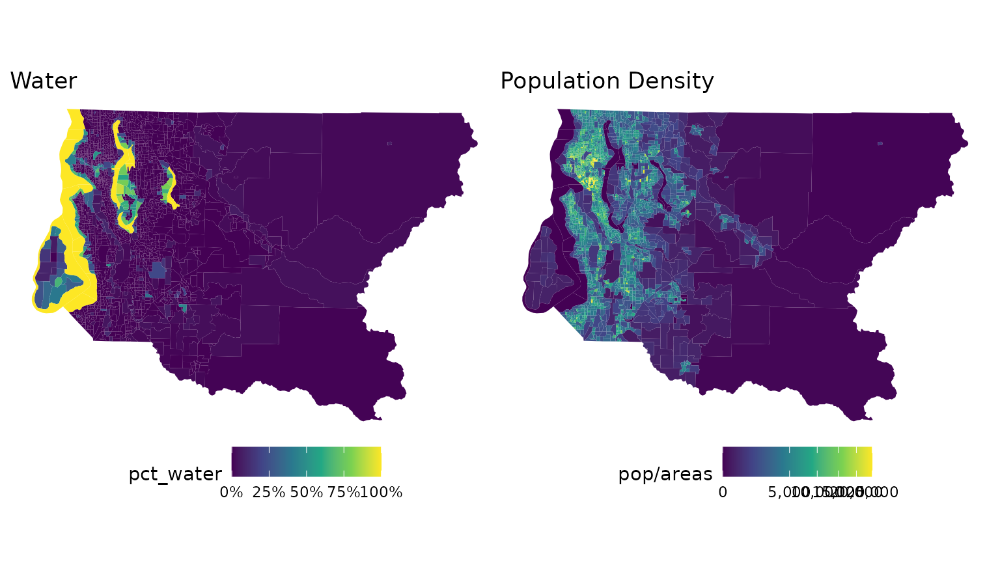
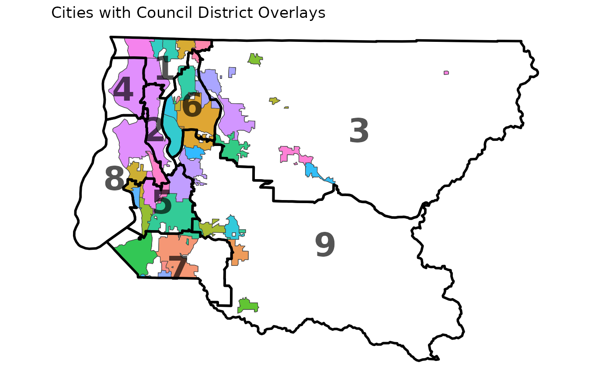
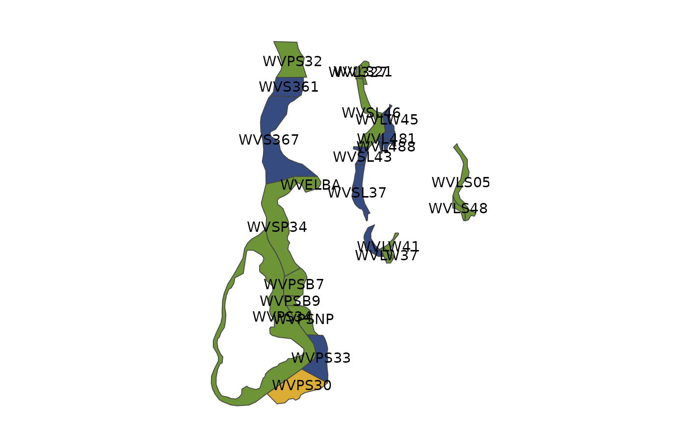
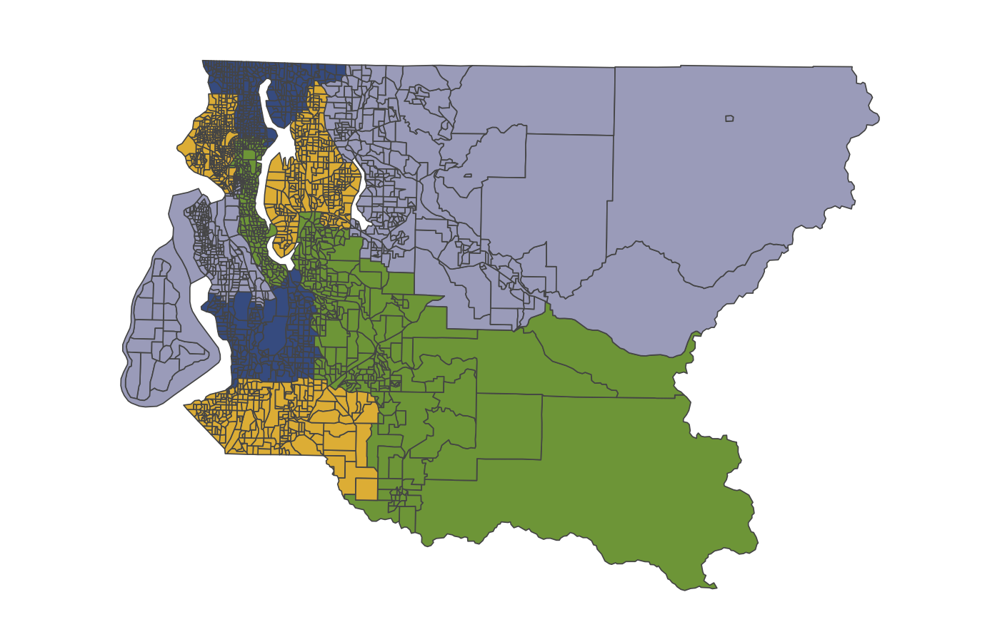
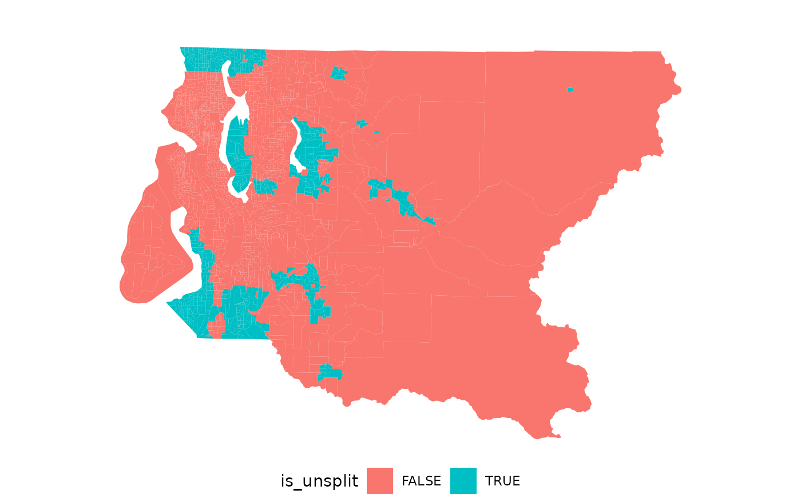
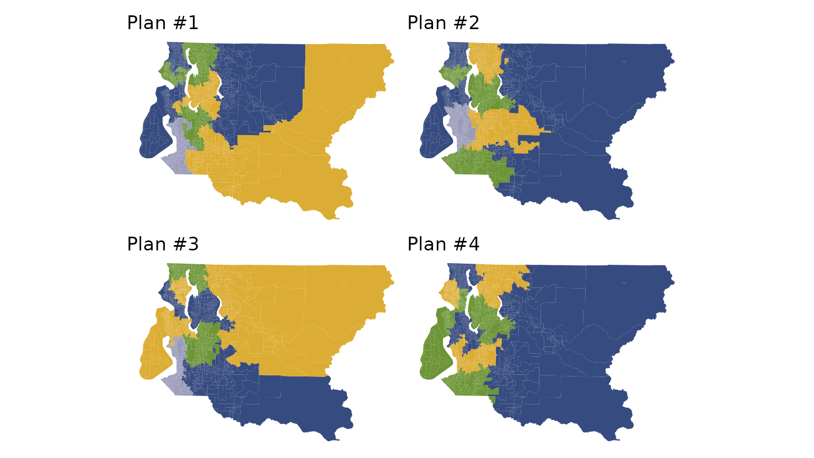
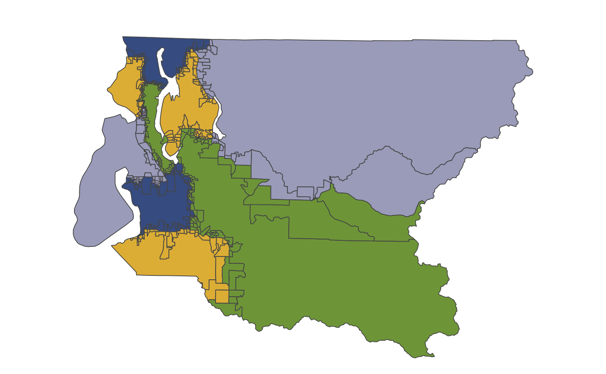
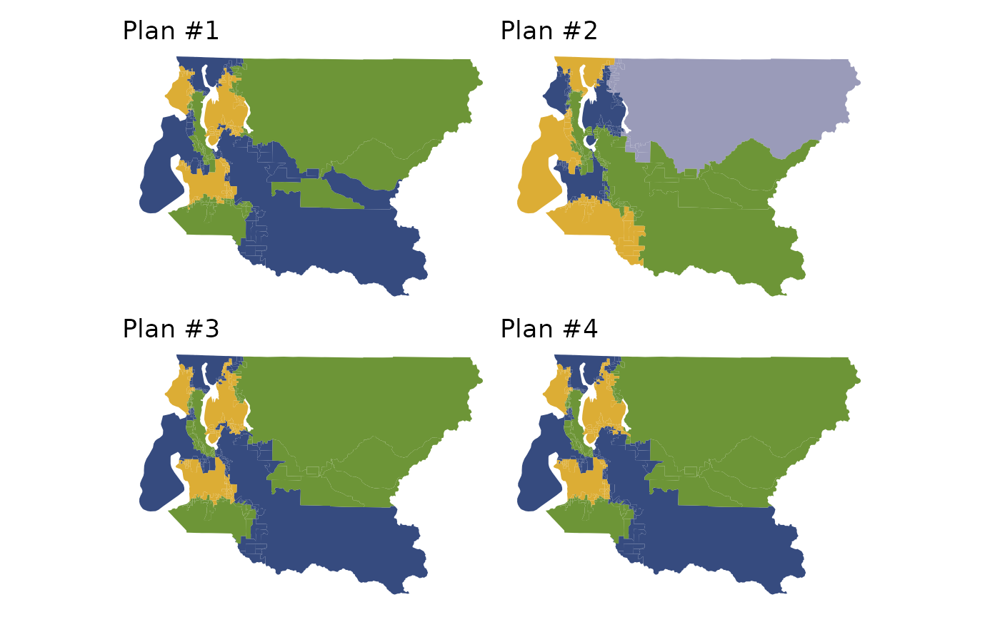

# Map Pre-processing for Special Constraints

In redistricting analysis, it is often useful or necessary to analyze
only a portion of a map, or hold some districts fixed while others are
re-simulated. Other analyses might require a status-quo-type constraint
that encourages simulated districts to be close to a reference plan.

All of these requirements may be achieved through map pre-processing,
and this vignette shows how to use `redist` to do so, using the
Metropolitan King County Council districts as an example.

## The Map

King County is the most populous county in the state of Washington, and
contains the city of Seattle. The nine members of the county council are
elected from single-member districts which are redrawn every decade.
According to the [county
charter](https://aqua.kingcounty.gov/council/clerk/code/03_Charter.htm),
the districts should be “drawn to produce districts with compact and
contiguous territory, composed of economic and geographic units and
approximately equal in population,” and should follow municipality lines
as much as possible.

The precinct data are available online, and contain population,
presidential vote, city, and existing district information.

``` r
library(dplyr)
library(ggplot2)
library(scales)
library(patchwork)

library(redist)

data_url <- "https://github.com/alarm-redist/redist-data/raw/main/data/king_county.rds"
data_path <- tempfile()
download.file(data_url, data_path)
king_shp <- readRDS(data_path)
print(king_shp)
#> Simple feature collection with 2562 features and 10 fields
#> Attribute-geometry relationships: constant (3), aggregate (5), identity (2)
#> Geometry type: MULTIPOLYGON
#> Dimension:     XY
#> Bounding box:  xmin: 1217170 ymin: 31464.84 xmax: 1583214 ymax: 287944.6
#> Projected CRS: NAD83(HARN) / Washington North (ftUS)
#> # A tibble: 2,562 × 11
#>    id     precinct    city     distr   pop   vap voters dem_08 rep_08 pct_water
#>  * <chr>  <chr>       <chr>    <int> <int> <int>  <dbl>  <dbl>  <dbl>     <dbl>
#>  1 333518 AUB 30-3518 AUB          7  1035   780    641    249    221   0      
#>  2 331066 AUB 30-1066 AUB          7   588   466    372    172    123   0      
#>  3 332446 PEGGY       UNINCORP     7  1290   950    763    339    262   0      
#>  4 332573 AUB 30-2573 AUB          7   948   710    644    305    217   0      
#>  5 333539 AUB 30-3539 AUB          7   663   486    419    188    156   0      
#>  6 333538 AUB 30-3538 AUB          7  1214   892    716    328    240   0      
#>  7 330045 AUB 47-0045 AUB          7   731   656    433    190    105   0.00538
#>  8 330427 EXCALIBUR   UNINCORP     7   660   501    402    164    151   0.00689
#>  9 333087 FED 30-3087 FED          7   820   645    453    223    124   0      
#> 10 333238 FED 30-3238 FED          7   997   674    356    161     90   0      
#> # ℹ 2,552 more rows
#> # ℹ 1 more variable: geometry <MULTIPOLYGON [US_survey_foot]>
```

There are 39 incorporated cities in King County, which together cover
19% of the population and 19% of the area of the county. The remainder
is “unincorporated King County”. The county contains a significant
amount of water, too, which complicates the drawing of districts; Vashon
Island in the southwest part of the county is not connected to the rest
of the county by land.

We”ll start by looking at some maps of the county and the districts.





## Creating the `redist_map` object

The first step one in a `redist` analysis is creating the `redist_map`
object, which stores the basic parameters of the redistricting problem.
Among these parameters is the desired level of population parity. Here,
we”ll compute the parity of the current set of districts, and ensure
that all of our simulations do no worse.

``` r
existing_parity <- redist.parity(king_shp$distr, king_shp$pop)
king <- redist_map(king_shp, existing_plan = distr, pop_tol = existing_parity)
print(king)
#> A <redist_map> with 2562 units and 12 fields
#> To be partitioned into 9 districts with population between 214,505.7 - 1.663204% and 214,505.7 + 1.663204%
#> With geometry:
#>     bbox:           xmin: 1217170 ymin: 31464.84 xmax: 1583214 ymax: 287944.6
#>     projected CRS:  NAD83(HARN) / Washington North (ftUS)
#> # A tibble: 2,562 × 12
#>    id     precinct    city     distr   pop   vap voters dem_08 rep_08 pct_water
#>  * <chr>  <chr>       <chr>    <int> <int> <int>  <dbl>  <dbl>  <dbl>     <dbl>
#>  1 333518 AUB 30-3518 AUB          7  1035   780    641    249    221   0      
#>  2 331066 AUB 30-1066 AUB          7   588   466    372    172    123   0      
#>  3 332446 PEGGY       UNINCORP     7  1290   950    763    339    262   0      
#>  4 332573 AUB 30-2573 AUB          7   948   710    644    305    217   0      
#>  5 333539 AUB 30-3539 AUB          7   663   486    419    188    156   0      
#>  6 333538 AUB 30-3538 AUB          7  1214   892    716    328    240   0      
#>  7 330045 AUB 47-0045 AUB          7   731   656    433    190    105   0.00538
#>  8 330427 EXCALIBUR   UNINCORP     7   660   501    402    164    151   0.00689
#>  9 333087 FED 30-3087 FED          7   820   645    453    223    124   0      
#> 10 333238 FED 30-3238 FED          7   997   674    356    161     90   0      
#> # ℹ 2,552 more rows
#> # ℹ 2 more variables: geometry <MULTIPOLYGON [US_survey_foot]>, adj <list>
```

This `redist_map` object contains an adjacency graph for the county. We
can explore this graph, and zoom in on the city of Seattle, using
[`plot()`](https://rdrr.io/r/graphics/plot.default.html).

``` r
plot(king, adj = TRUE, centroids = FALSE, zoom_to = (city == "SEA"))
```


## Subsetting

Often, we wish to restrict our analysis to a part of a map or only a few
of the districts. This is supported in `redist` using the
[`filter()`](https://dplyr.tidyverse.org/reference/filter.html) function
from [`dplyr`](https://dplyr.tidyverse.org/). The package”s version of
[`filter()`](https://dplyr.tidyverse.org/reference/filter.html) will
automatically update the adjacency graph, the number of districts, and
the relevant population bounds.

### Specific districts

Suppose we wanted to study districts 2, 4, and 8, which cover most of
Seattle.

``` r
filter(king, distr %in% c(2, 4, 8))
#> A <redist_map> with 960 units and 12 fields
#> To be partitioned into 3 districts with population between 214,505.7 - 1.663204% and 214,505.7 + 1.663204%
#> With geometry:
#>     bbox:           xmin: 1217170 ymin: 120178.2 xmax: 1297890 ymax: 271519.8
#>     projected CRS:  NAD83(HARN) / Washington North (ftUS)
#> # A tibble: 960 × 12
#>    id     precinct    city     distr   pop   vap voters dem_08 rep_08 pct_water
#>  * <chr>  <chr>       <chr>    <int> <int> <int>  <dbl>  <dbl>  <dbl>     <dbl>
#>  1 330374 DOLPHIN     UNINCORP     8   378   296    291    199     53     0.447
#>  2 330236 BILOXI      UNINCORP     8   534   436    432    295     81     0.394
#>  3 330370 DILWORTH    UNINCORP     8   536   424    420    299     66     0.293
#>  4 331520 SEA 34-1520 SEA          8   407   316    312    237     49     0.398
#>  5 333266 SEA 34-3266 SEA          8   601   495    246    160     31     0    
#>  6 333265 SEA 34-3265 SEA          8   741   561    315    231     38     0    
#>  7 331515 SEA 34-1515 SEA          8   524   418    353    276     34     0    
#>  8 331512 SEA 34-1512 SEA          8   379   307    262    200     33     0    
#>  9 331517 SEA 34-1517 SEA          8   353   295    239    193     17     0    
#> 10 331519 SEA 34-1519 SEA          8   407   328    282    211     44     0    
#> # ℹ 950 more rows
#> # ℹ 2 more variables: geometry <MULTIPOLYGON [US_survey_foot]>, adj <list>
```

Looking at the information in the header, and comparing it to the
original `king` object, we see that the number of districts has been
updated from 9 to 3, and the population tolerances have been updated
from 214,506 ± 1.663% to 213,049 - 0.9909% and 213,049 + 2.358%. Not
visible but equally important are the edits to the adjacency graph to
reflect the new geometry of the map.

### Dealing with water and islands

Another way we might want to subset would be to cut out the precincts
which are just water, so that districts won”t unnecessarily cross bodies
of water. Of course, we”ll have to ensure that Vashon Island is still
connected to the mainland by at least one precinct. We”ll start by
subsetting to the water precincts and plotting labels.

``` r
plot(filter(king, pct_water >= 0.99, pop == 0)) + geom_sf_text(aes(label = id))
#> Warning: Your subset was not based on districts.
#> → Please use `set_pop_tol()` to update your <redist_map> or create a new
#>   <redist_map> with the correct number of districts.
```



We see that by removing all water precincts except WVPS34 and WVSP34, we
can maintain a connection between the island and the mainland
(incidentally, the state ferry connecting the island to Seattle runs
through these precincts).

``` r
water_prec <- filter(king, pct_water >= 0.99, pop == 0) %>% pull(id)
#> Warning: Your subset was not based on districts.
#> → Please use `set_pop_tol()` to update your <redist_map> or create a new
#>   <redist_map> with the correct number of districts.
water_prec <- setdiff(water_prec, c("WVPS34", "WVSP34"))
king_land <- filter(king, !(id %in% water_prec))
plot(king_land)
```



Zooming in again to view the adjacency graph in the city of Seattle, we
see that the graph has been appropriately edited to remove the water
precincts.

``` r
plot(king_land, adj = TRUE, centroids = FALSE, zoom_to = (city == "SEA"))
```


## Merging

Often, we want to merge some units together to form larger units, either
to visualize or analyze at a coarser scale, or to ensure that the merged
units are treated as one “block” in any redistricting algorithm. Merging
units is a part of most map preprocessing workflows, and in `redist` is
carried out by the
[`merge_by()`](http://alarm-redist.org/redist/reference/merge_by.md)
function, which works like a combination of the
[`group_by()`](https://dplyr.tidyverse.org/reference/group_by.html) and
[`summarize()`](https://dplyr.tidyverse.org/reference/summarise.html)
verbs of `dplyr`.

For example, we could merge our King County data by city.

``` r
merge_by(king_land, city)
#> Warning: There was 1 warning in `dplyr::summarize()`.
#> ℹ In argument: `dplyr::across(where(is.numeric), sum, na.rm = TRUE)`.
#> ℹ In group 1: `distr = 1`, `city = "BOT"`.
#> Caused by warning:
#> ! The `...` argument of `across()` is deprecated as of dplyr 1.1.0.
#> Supply arguments directly to `.fns` through an anonymous function instead.
#> 
#>   # Previously
#>   across(a:b, mean, na.rm = TRUE)
#> 
#>   # Now
#>   across(a:b, \(x) mean(x, na.rm = TRUE))
#> ℹ The deprecated feature was likely used in the redist package.
#>   Please report the issue at <https://github.com/alarm-redist/redist/issues>.
#> A <redist_map> with 60 units and 11 fields
#> To be partitioned into 9 districts with population between 214,505.7 - 1.663204% and 214,505.7 + 1.663204%
#> Merged from another map with reindexing: int [1:2541] 41 41 46 41 41 ...
#> # A tibble: 60 × 11
#>    distr city  pct_water    pop    vap voters dem_08 rep_08 id    precinct adj  
#>    <int> <chr>     <dbl>  <int>  <int>  <dbl>  <dbl>  <dbl> <chr> <chr>    <lis>
#>  1     1 BOT     0        17090  13312 9.89e3  5259   3017  3332… BOT 01-… <int>
#>  2     1 KIR     0.0503    7036   5856 3.91e3  2191    947  3329… KIR 45-… <int>
#>  3     1 KMR     0.0128   20460  15787 1.30e4  7288   3476  3306… KMR 32-… <int>
#>  4     1 LFP     0.0281   12598   9975 9.47e3  6063   1992  3306… LFP 32-… <int>
#>  5     1 SEA     0.00845  72503  59161 4.79e4 34664   6527  3323… SEA 46-… <int>
#>  6     1 SHL     0.00447  53007  42873 3.43e4 20895   7184  3325… SHL 32-… <int>
#>  7     1 UNIN…   0.0536   24780  19208 1.54e4  8370   4440  3305… JEAN~CE… <int>
#>  8     1 WOD     0.00260   8059   6163 4.79e3  2480   1505  3327… WOD 45-… <int>
#>  9     2 SEA     0.0408  195293 162191 1.17e5 84203  10899  3318… SEA 43-… <int>
#> 10     2 UNIN…   0.0248   15645  11866 7.46e3  4654.  1211. 3309… RAINIER… <int>
#> # ℹ 50 more rows
```

Under the hood,
[`merge_by()`](http://alarm-redist.org/redist/reference/merge_by.md)
does several things. First, it groups the shapefile by the provided key
or keys (here, `city`). By default it also groups by existing districts,
so that the merged units will still follow district boundaries. Then for
each remaining column,
[`merge_by()`](http://alarm-redist.org/redist/reference/merge_by.md)
tries to automatically summarize it. Most numeric columns are summed
(but columns with percentage values are averaged), and most character
columns are collapsed into summary variables. You can read more about
the details of this process in [the
documentation](http://alarm-redist.org/redist/reference/merge_by.md).
Finally,
[`merge_by()`](http://alarm-redist.org/redist/reference/merge_by.md)
makes the appropriate edits to the adjacency graph.

Merging geographic shapefile units can be computationally intensive, and
so by default
[`merge_by()`](http://alarm-redist.org/redist/reference/merge_by.md)
drops the geometry before merging. This is OK for analysis purposes,
since all of the relevant adjacency information is still encoded in the
graph. After analysis, you can use the
[`pullback()`](http://alarm-redist.org/redist/reference/pullback.md)
method to un-merge objects and restore plotting capability. However,
should you want to preserve the geometry through merging, you can simply
set `drop_geom=FALSE`.

``` r
king_merged <- merge_by(king_land, city, drop_geom = FALSE)
plot(king_merged, adj = TRUE)
```


We will see more uses of
[`merge_by()`](http://alarm-redist.org/redist/reference/merge_by.md) in
the sections below.

## Freezing

Sometimes, rather than completely remove a portion of a map, we want to
freeze it in place, so that all of the units in that portion stay
together in the same district. The reasons for doing this might vary,
but include enforcing a county or administrative boundary split
constraint, aiding in setting up Voting Rights Act constraints, or
preparing a map to be optimized according to a set of criteria.

In the context of King County Council seats, we might want to implement
the requirement that districts follow municipal lines by ensuring that
any sampled redistricting plans not split any municipalities which are
not split by the existing plan. That way, the number of split
municipalities in the set of sampled plans will be guaranteed to not
exceed the number of existing splits.

In `redist`, freezing is accomplished by using the
[`freeze()`](http://alarm-redist.org/redist/reference/redist.freeze.md)
and [`merge_by()`](http://alarm-redist.org/redist/reference/merge_by.md)
functions. The former takes in a description of the units which should
be frozen, and groups them into contiguous chunks of frozen units,
returning an indexing vector that uniquely identifies each group. Then
[`merge_by()`](http://alarm-redist.org/redist/reference/merge_by.md)
merges these groups together. We can use the
[`redist.splits()`](http://alarm-redist.org/redist/reference/redist.splits.md)
function to count split municipalities, and the
[`is_county_split()`](http://alarm-redist.org/redist/reference/is_county_split.md)
function to identify split municipalities.

``` r
cat(splits_admin(king_land$distr, king_land, city), "split cities\n")
#> 11 11 11 11 11 11 11 11 11 split cities

king_land %>%
  mutate(is_unsplit = !is_county_split(distr, city)) %>%
  plot(is_unsplit)
```



``` r

king_unsplit <- king_land %>%
  mutate(unsplit_id = freeze(!is_county_split(distr, city))) %>%
  merge_by(unsplit_id, city, collapse_chr = FALSE)
print(king_unsplit)
#> A <redist_map> with 1968 units and 10 fields
#> To be partitioned into 9 districts with population between 214,505.7 - 1.663204% and 214,505.7 + 1.663204%
#> Merged from another map with reindexing: int [1:2541] 1410 1410 1414 1410 1410 ...
#> # A tibble: 1,968 × 10
#>    distr unsplit_id city  pct_water   pop   vap voters dem_08 rep_08 adj       
#>    <int>      <int> <chr>     <dbl> <int> <int>  <dbl>  <dbl>  <dbl> <list>    
#>  1     1         67 SEA     0        1227  1115    601    420     83 <int [7]> 
#>  2     1         68 SEA     0         663   533    467    359     46 <int [6]> 
#>  3     1         69 SEA     0         563   455    376    286     47 <int [5]> 
#>  4     1         70 SEA     0         369   298    248    190     28 <int [5]> 
#>  5     1         71 SEA     0         423   360    296    233     27 <int [5]> 
#>  6     1         72 SEA     0         580   488    406    310     47 <int [6]> 
#>  7     1        101 BOT     0       17090 13312   9894   5259   3017 <int [13]>
#>  8     1        101 KMR     0.0128  20460 15787  12954   7288   3476 <int [10]>
#>  9     1        101 LFP     0.0281  12598  9975   9465   6063   1992 <int [4]> 
#> 10     1        101 SHL     0.00447 53007 42873  34346  20895   7184 <int [14]>
#> # ℹ 1,958 more rows
```

The plot above shows which cities will be frozen together so that they
cannot be split. Notice that we merge by not just `unsplit_id` but also
`city`, so that adjacent unsplit cities are not merged together. We also
set `collapse_chr=FALSE` to drop the `id` and `precinct` columns, which
become slightly unwieldy after a large merge.

To see this in action, we”ll sample 100 redistricting plans using
[`redist_smc()`](http://alarm-redist.org/redist/reference/redist_smc.md)
on this partially frozen map. We”ll use
[`pullback()`](http://alarm-redist.org/redist/reference/pullback.md) to
then reconstruct the plan output of
[`redist_smc()`](http://alarm-redist.org/redist/reference/redist_smc.md)
so that it is congruous with the original geometry object, `king_land`.

``` r
plans <- redist_smc(king_unsplit, 100, silent = TRUE)
print(plans)
#> A <redist_plans> containing 100 sampled plans and 1 reference plan
#> Plans have 9 districts from a 1,968-unit map, and were drawn using Sequential
#> Monte Carlo.
#> Merged from another map with reindexing: int [1:2541] 1410 1410 1414 1410 1410 ...
#> With plans resampled from weights
#> Plans matrix: int [1:1968, 1:101] 1 1 1 1 1 1 1 1 1 1 ...
#> # A tibble: 909 × 3
#>    draw  district total_pop
#>    <fct>    <int>     <dbl>
#>  1 distr        1    215533
#>  2 distr        2    210938
#>  3 distr        3    213700
#>  4 distr        4    215718
#>  5 distr        5    216833
#>  6 distr        6    213696
#>  7 distr        7    214210
#>  8 distr        8    212491
#>  9 distr        9    217432
#> 10 1            1    214053
#> # ℹ 899 more rows
print(pullback(plans))
#> A <redist_plans> containing 100 sampled plans and 1 reference plan
#> Plans have 9 districts from a 2,541-unit map, and were drawn using Sequential
#> Monte Carlo.
#> With plans resampled from weights
#> Plans matrix: int [1:2541, 1:101] 7 7 7 7 7 7 7 7 7 7 ...
#> # A tibble: 909 × 3
#>    draw  district total_pop
#>    <fct>    <int>     <dbl>
#>  1 distr        1    215533
#>  2 distr        2    210938
#>  3 distr        3    213700
#>  4 distr        4    215718
#>  5 distr        5    216833
#>  6 distr        6    213696
#>  7 distr        7    214210
#>  8 distr        8    212491
#>  9 distr        9    217432
#> 10 1            1    214053
#> # ℹ 899 more rows
redist.plot.plans(pullback(plans), draws = 1:4, shp = king_land)
```



Notice how the `Merged from another map...` line disappears and the
number of map units changes after using
[`pullback()`](http://alarm-redist.org/redist/reference/pullback.md).
Notice also that each of the sampled plans completely preserves the
municipalities which were frozen with
[`freeze()`](http://alarm-redist.org/redist/reference/redist.freeze.md)
and
[`merge_by()`](http://alarm-redist.org/redist/reference/merge_by.md).

## District Cores

A common requirement in redistricting is that districts after
redistricting resemble the original districts, or [“preserve the cores”
of previous
districts](https://documents.ncsl.org/wwwncsl/Redistricting-Census/Redistricting-Law-2020_NCSL%20FINAL.pdf),
to ensure relative continuity of representation. The `redist` package
operationalizes this idea by explicitly constructing the cores of a set
of districts with
[`make_cores()`](http://alarm-redist.org/redist/reference/redist.identify.cores.md),
and merging them together with
[`merge_by()`](http://alarm-redist.org/redist/reference/merge_by.md).

The idea for constructing district cores is to work inwards from
district boundaries. First, we merge each district completely. Then, we
un-freeze the precincts which lie along district boundaries. Then, we
un-freeze the precincts which were unfrozen in the previous step. We
repeat this process a user-specified number of times, leaving only the
central “cores” of each district frozen. When it comes time to simulate,
these cores will be assigned a district as a unit, preserving
representation for all the people living in the core.

The
[`make_cores()`](http://alarm-redist.org/redist/reference/redist.identify.cores.md)
function takes a `boundary` parameter which counts the number of these
steps; `boundary=1` corresponds to un-freezing the precincts along the
boundary only. This is often sufficient for a moderate-to-strong status
quo constraint.

For example, if we set `boundary=1` in King county, 82% of the
population lives inside a district core, while with `boundary=2` that
number drops to 58%.

``` r
pop_inside_cores <- function(boundary) {
  king_land %>%
    mutate(core = make_cores(boundary = boundary)) %>%
    as_tibble() %>%
    group_by(core) %>%
    filter(n() > 2) %>% # filter to cores only
    pull(pop) %>%
    sum()
}
pop_inside_cores(1) / sum(king_land$pop)
#> [1] 0.8254058
pop_inside_cores(2) / sum(king_land$pop)
#> [1] 0.5909499
```

Here, we”ll use `boundary=1`. We can see how large areas inside each
district are merged together after applying
[`merge_by()`](http://alarm-redist.org/redist/reference/merge_by.md) to
the generated cores.

``` r
king_cores <- king_land %>%
  mutate(core = make_cores(boundary = 1)) %>%
  merge_by(core, drop_geom = FALSE)
plot(king_cores)
```



If we sample redistrict plans from this modified map, we observe that
the simulated plans generally follow the same location and shape as the
original plan. Sampling is also faster, since there are fewer units in
the map.

``` r
plans <- redist_smc(king_cores, 100, silent = TRUE)
redist.plot.plans(plans, draws = 1:4, shp = king_cores)
```


