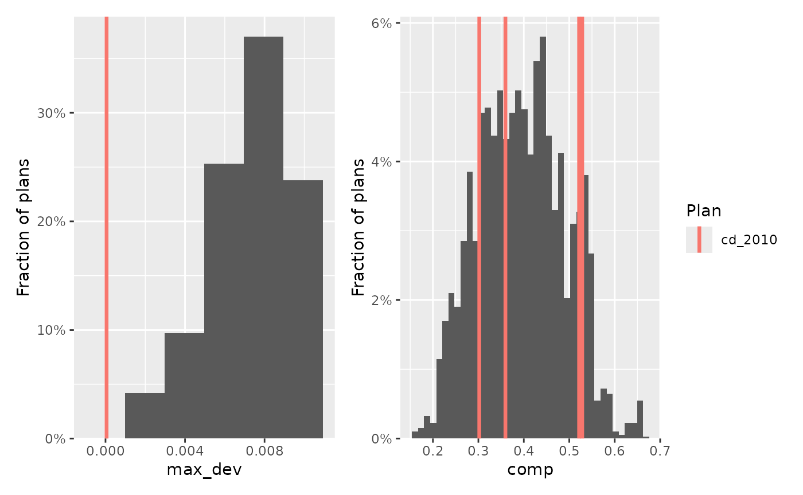

# Introduction to redist

The `redist` package provides algorithms and tools for scalable and
replicable redistricting analyses. This vignette introduces the package
by way of an analysis of redistricting in the state of Iowa, which can
broken down into four distinct steps:

1.  [Compiling, cleaning, and preparing the data](#prepare)
2.  [Defining the redistricting problem](#define)
3.  [Simulating redistricting plans](#simulate)
4.  [Analyzing the simulated plans](#analyze)

First, however, a brief overview of the package itself.

``` r
library(redist)
library(dplyr)
library(ggplot2)
```

## The `redist` package

To install `redist`, follow the instructions in the
[README](https://alarm-redist.org/redist/#installation-instructions).

For more information on package components, check out the [full
documentation](https://alarm-redist.org/redist/).

### Algorithms

The package contains a variety of redistricting simulation and
enumeration algorithms. Generally you will use one of the following
three algorithms:

- [`redist_smc()`](http://alarm-redist.org/redist/reference/redist_smc.md),
  the recommended algorithm for most purposes.[¹](#fn1)
- [`redist_mergesplit()`](http://alarm-redist.org/redist/reference/redist_mergesplit.md),
  a MCMC version of the SMC proposal.[²](#fn2)
- [`redist_flip()`](http://alarm-redist.org/redist/reference/redist_flip.md),
  another MCMC algorithm which uses more local proposals.[³](#fn3)

The other algorithms are

- [`redist.enumpart()`](http://alarm-redist.org/redist/reference/redist.enumpart.md)
  for efficient enumeration of small maps.[⁴](#fn4)
- [`redist_shortburst()`](http://alarm-redist.org/redist/reference/redist_shortburst.md)
  for optimizing a plan according to a user-provided criterion.[⁵](#fn5)
- [`redist.rsg()`](http://alarm-redist.org/redist/reference/redist.rsg.md)
  and
  [`redist.crsg()`](http://alarm-redist.org/redist/reference/redist.crsg.md),
  which do not sample from a known target distribution.[⁶](#fn6)

### Data

The package comes with several built-in datasets, which may be useful in
exploring the package’s functionality and in becoming familiar with
algorithmic redistricting:

- [`iowa`](http://alarm-redist.org/redist/reference/iowa.md) (used in
  this vignette).
- [`fl25`](http://alarm-redist.org/redist/reference/fl25.md), a
  25-precinct subset of the state of Florida.
- [`fl25_enum`](http://alarm-redist.org/redist/reference/fl25_enum.md),
  containing all possible sets of three districts drawn on the
  25-precinct Florida map.
- [`fl70`](http://alarm-redist.org/redist/reference/fl70.md), a
  70-precinct subset of the state of Florida.
- [`fl250`](http://alarm-redist.org/redist/reference/fl250.md), a
  250-precinct subset of the state of Florida.

## Compiling, cleaning, and preparing the data

The most time-consuming part of a redistricting analysis, like most data
analyses, is collecting and cleaning the necessary data. For
redistricting, this data includes geographic shapefiles for precincts
and existing legislative district plans, precinct- or block-level
demographic information from the Census, and precinct-level political
data. These data generally come from different sources, and may not
fully overlap with each other, further complicating the problem.

`redist` is not focused on this data collection process. The
[`geomander`](https://christophertkenny.com/geomander/) package contains
many helpful functions for compiling these data, and fixing problems in
geographic data.

The ALARM project provides [pre-cleaned redistricting data
files](https://alarm-redist.org/posts/2021-08-10-census-2020/)
consisting of VEST election data joined 2020 Census data at the precinct
level. Other sources for precinct-level geographic and political
information include the [MIT Election
Lab](https://electionlab.mit.edu/data), the
[Census](https://www.census.gov/programs-surveys/decennial-census/about/rdo.html),
the [Redistricting Data Hub](https://redistrictingdatahub.org/), the
[Voting and Election Science Team](https://x.com/vest_team), the Harvard
Election Data Archive, the [Metric Geometry and Gerrymandering
Group](https://github.com/mggg-states), and some state websites.

### Iowa

For this analysis of Iowa, we’ll use the data included in the package,
which was compiled from the Census and the Harvard Election Data
Archive. It contains, for each county, the total population and
voting-age population by race, as well as the number of votes for
President in 2008. The `geometry` column contains the geographic
[shapefile information](https://r-spatial.github.io/sf/).

``` r
data(iowa)
print(iowa)
#> Simple feature collection with 99 features and 15 fields
#> Geometry type: MULTIPOLYGON
#> Dimension:     XY
#> Bounding box:  xmin: 4081849 ymin: 2879102 xmax: 5834228 ymax: 4024957
#> Projected CRS: NAD83(HARN) / Iowa North (ftUS)
#> First 10 features:
#>     fips       name cd_2010    pop  white black hisp    vap  wvap bvap hvap
#> 1  19001      Adair       3   7682   7507    11  101   5957  5860    5   53
#> 2  19003      Adams       3   4029   3922     8   37   3180  3109    6   22
#> 3  19005  Allamakee       1  14330  13325   109  757  11020 10430   82  425
#> 4  19007  Appanoose       2  12887  12470    55  181   9993  9745   40   99
#> 5  19009    Audubon       4   6119   6007     9   37   4780  4714    5   27
#> 6  19011     Benton       1  26076  25387    93  275  19430 19068   49  155
#> 7  19013 Black Hawk       1 131090 109968 11493 4907 102594 89541 7677 2865
#> 8  19015      Boone       4  26306  25194   202  505  20027 19448  103  260
#> 9  19017     Bremer       1  24276  23459   186  239  18763 18242  155  137
#> 10 19019   Buchanan       1  20958  20344    59  243  15282 14979   32  128
#>    tot_08 dem_08 rep_08    region                       geometry
#> 1    4053   1924   2060     South MULTIPOLYGON (((4592338 328...
#> 2    2206   1118   1046     South MULTIPOLYGON (((4528041 315...
#> 3    7059   3971   2965 Northeast MULTIPOLYGON (((5422507 401...
#> 4    6176   2970   3086     South MULTIPOLYGON (((5032545 306...
#> 5    3435   1739   1634 Northwest MULTIPOLYGON (((4487363 341...
#> 6   13712   7058   6447 Southeast MULTIPOLYGON (((5246216 357...
#> 7   64775  39184  24662 Northeast MULTIPOLYGON (((5175640 369...
#> 8   13929   7356   6293   Central MULTIPOLYGON (((4741174 354...
#> 9   12871   6940   5741 Northeast MULTIPOLYGON (((5174636 379...
#> 10  10338   6050   4139 Northeast MULTIPOLYGON (((5302846 370...
```

## Defining the redistricting problem

A redistricting problem is defined by the map of the precincts, the
number of contiguous districts to divide the precincts into, the level
of population parity to enforce, and any other necessary constraints
that must be imposed.

### Determining the relevant constraints

In Iowa, congressional districts are constructed not out of precincts
but out of the state’s 99 counties, and in the 2010 redistricting cycle,
Iowa was apportioned four congressional districts, down one from the
2000 cycle. Chapter 42 of the Iowa Code provides guidance on the other
constraints imposed on the redistricting process (our emphasis added):

> **42.4 Redistricting standards.**
>
> …
>
> 1.b. Congressional districts shall each have a population *as nearly
> equal as practicable* to the ideal district population, derived as
> prescribed in paragraph “a” of this subsection. No congressional
> district shall have a population which varies by more than *one
> percent from the applicable ideal district population*, except as
> necessary to comply with Article III, section 37 of the Constitution
> of the State of Iowa.
>
> …
>
> 3\. Districts shall be composed of convenient *contiguous territory*.
> Areas which meet only at the points of adjoining corners are not
> contiguous.
>
> 4\. Districts shall be *reasonably compact* in form, to the extent
> consistent with the standards established by subsections 1, 2, and 3.
> In general, reasonably compact districts are those which are square,
> rectangular, or hexagonal in shape, and not irregularly shaped, to the
> extent permitted by natural or political boundaries….
>
> 5\. No district shall be drawn for the purpose of favoring a political
> party, incumbent legislator or member of Congress, or other person or
> group, or for the purpose of augmenting or diluting the voting
> strength of a language or racial minority group. In establishing
> districts, *no use shall be made* of any of the following data:
>
> 1.  Addresses of incumbent legislators or members of Congress.
> 2.  Political affiliations of registered voters.
> 3.  Previous election results.
> 4.  Demographic information, other than population head counts, except
>     as required by the Constitution and the laws of the United States.

The section goes on to provide two specific measures of compactness that
should be used to compare districts, one of which is the total perimeter
of all districts. If the total perimeter is small, then the districts
relatively compact.

Contiguity of districts and no reliance on partisan or demographic data
are built-in to `redist`. We’ll look at how to specify the desired
population deviation (no more than 1% by law) in the next section, and
discuss compactness in the [simulation section](#simulate).

### Setting up the problem in `redist`

In `redist`, a basic redistricting problem is defined by an object of
type `redist_map`, which can be constructed using the eponymous
function. The user must provide a vector of population counts (defaults
to the `pop` column, if one exists) and the desired population parity,
and the number of districts. The latter can be inferred if a reference
redistricting plan exists. For Iowa, we’ll use the adopted 2010 plan as
a reference.

``` r
iowa_map = redist_map(iowa, existing_plan=cd_2010, pop_tol=0.01, total_pop = pop)
print(iowa_map)
#> A <redist_map> with 99 units and 17 fields
#> To be partitioned into 4 districts with population between 761,588.8 - 1.0% and 761,588.8 + 1.0%
#> With geometry:
#>     bbox:           xmin: 4081849 ymin: 2879102 xmax: 5834228 ymax: 4024957
#>     projected CRS:  NAD83(HARN) / Iowa North (ftUS)
#> # A tibble: 99 × 17
#>    fips  name  cd_2010    pop  white black  hisp    vap  wvap  bvap  hvap tot_08
#>  * <chr> <chr>   <int>  <dbl>  <dbl> <dbl> <dbl>  <dbl> <dbl> <dbl> <dbl>  <dbl>
#>  1 19001 Adair       3   7682   7507    11   101   5957  5860     5    53   4053
#>  2 19003 Adams       3   4029   3922     8    37   3180  3109     6    22   2206
#>  3 19005 Alla…       1  14330  13325   109   757  11020 10430    82   425   7059
#>  4 19007 Appa…       2  12887  12470    55   181   9993  9745    40    99   6176
#>  5 19009 Audu…       4   6119   6007     9    37   4780  4714     5    27   3435
#>  6 19011 Bent…       1  26076  25387    93   275  19430 19068    49   155  13712
#>  7 19013 Blac…       1 131090 109968 11493  4907 102594 89541  7677  2865  64775
#>  8 19015 Boone       4  26306  25194   202   505  20027 19448   103   260  13929
#>  9 19017 Brem…       1  24276  23459   186   239  18763 18242   155   137  12871
#> 10 19019 Buch…       1  20958  20344    59   243  15282 14979    32   128  10338
#> # ℹ 89 more rows
#> # ℹ 5 more variables: dem_08 <dbl>, rep_08 <dbl>, region <chr>,
#> #   geometry <MULTIPOLYGON [US_survey_foot]>, adj <list>
```

This looks much the same as `iowa` itself, but metadata has been added,
and there’s a new column, `adj`.

### Adjacency-based redistricting

All redistricting algorithms operate on an *adjacency graph*, which is
constructed from the actual precinct or county geography. In the
adjacency graph, every precinct or county is a node, and two nodes are
connected by an edge if the corresponding precincts are geographically
adjacent.[⁷](#fn7) Creating a contiguous set of districts as part of a
redistricting plan then corresponds to creating a
[*partition*](https://en.wikipedia.org/wiki/Graph_partition) of the
adjacency graph.

The
[`redist_map()`](http://alarm-redist.org/redist/reference/redist_map.md)
function automatically computes the adjacency graph from the provided
shapefile (though one can be provided directly as well), and stores it
in the `adj` column as an *adjacency list*, which is, for each precinct,
a list of neighboring precincts. As part of this process, the adjacency
graph is checked for global contiguity (no islands), which is necessary
for the redistricting algorithms to function properly.

We can visualize the adjacency graph by plotting the `redist_map`
object.

``` r
plot(iowa_map, adj=TRUE) + plot(iowa_map)
```


### Pre-processing

Often, we want to only analyze a portion of a map, or hold some
districts fixed while others are re-simulated. We may also want to
implement a status-quo-type constraint that encourages simulated
districts to be close to a reference plan. This can be accomplished by
freezing the “cores” of each district.

All of these operations fall under the umbrella of map pre-processing,
and `redist` is well-equipped to handle them. You can use familiar
`dplyr` verbs like
[`filter()`](https://dplyr.tidyverse.org/reference/filter.html) and
[`summarize()`](https://dplyr.tidyverse.org/reference/summarise.html),
along with new `redist` operations like
[`freeze()`](http://alarm-redist.org/redist/reference/redist.freeze.md),
[`make_cores()`](http://alarm-redist.org/redist/reference/redist.identify.cores.md),
and
[`merge_by()`](http://alarm-redist.org/redist/reference/merge_by.md), to
operate on `redist_map` objects. The package will make the appropriate
modifications to the geometry and adjacency graph in the background.

The [map pre-processing
vignette](http://alarm-redist.org/redist/articles/map-preproc.md)
contains more information and examples about these operations.

### Exploring the geography

To get a feel for the demographic and political geography of the state,
we’ll make some plots from the `iowa_map` object. We see that the state
is mostly rural and white, with Polk county (Des Moines) the largest and
densest. Politically, most counties are relatively balanced between
Democrats and Republicans (at least in the ’08 election), though there
is a rough east-west gradient.

``` r
areas = as.numeric(units::set_units(sf::st_area(iowa_map$geometry), mi^2))
plot(iowa_map, fill = pop / areas) + 
    scale_fill_viridis_c(name="Population density (people / sq. mi)", 
                         trans="sqrt")
```


``` r
plot(iowa_map, fill = dem_08 / tot_08) +
    scale_fill_gradient2(name="Pct. Democratic '08",  midpoint=0.5)
```


``` r
plot(iowa_map, fill = wvap / vap, by_distr = TRUE)
```


## Simulating redistricting plans

The crux of a redistricting analysis is actually simulating new
redistricting plans. As discussed above, `redist` provides several
algorithms for performing this simulation, and each has its own
advantages and incorporates a different set of constraints. Here, we’ll
demonstrate use of the
[`redist_smc()`](http://alarm-redist.org/redist/reference/redist_smc.md)
algorithm, a Sequential Monte Carlo (SMC)-based procedure which is the
recommended choice for most redistricting analyses.

SMC creates plans directly, by drawing district boundaries one at a
time, as illustrated below.


Because of the way districts are drawn in SMC, the generated districts
are relatively compact by default. This can be further controlled by the
`compactness` parameter (although `compactness=1` is particularly
computationally convenient).

To simulate, we call
[`redist_smc()`](http://alarm-redist.org/redist/reference/redist_smc.md)
on our `redist_map` object. We provide the `runs=2` parameter, which
will run the SMC algorithm twice, in parallel. This doubles the total
number of sampled plans, but more importantly, it provides extremely
valuable diagnostic information about whether the algorithm is sampling
properly.

``` r
iowa_plans = redist_smc(iowa_map, 500, compactness=1, runs=2)
```

The output from the algorithm is a `redist_plans` object, which stores a
matrix of district assignments for each precinct and simulated plans,
and a table of summary statistics for each district and simulated plan.
The existing 2010 plan has also been automatically added as a reference
plan. Additional reference or comparison plans may be added using
[`add_reference()`](http://alarm-redist.org/redist/reference/add_reference.md).

``` r
print(iowa_plans)
#> A <redist_plans> containing 1,000 sampled plans and 1 reference plan
#> Plans have 4 districts from a 99-unit map, and were drawn using Sequential
#> Monte Carlo.
#> With plans resampled from weights
#> Plans matrix: int [1:99, 1:1001] 1 1 2 3 4 2 2 4 2 2 ...
#> # A tibble: 4,004 × 4
#>    draw    district total_pop chain
#>    <fct>      <int>     <dbl> <int>
#>  1 cd_2010        1    761612    NA
#>  2 cd_2010        2    761548    NA
#>  3 cd_2010        3    761624    NA
#>  4 cd_2010        4    761571    NA
#>  5 1              1    759274     1
#>  6 1              2    763216     1
#>  7 1              3    755788     1
#>  8 1              4    768077     1
#>  9 2              1    759558     1
#> 10 2              2    761089     1
#> # ℹ 3,994 more rows
```

We can explore specific simulated plans with
[`redist.plot.plans()`](http://alarm-redist.org/redist/reference/redist.plot.plans.md).

``` r
redist.plot.plans(iowa_plans, draws=1:6, shp=iowa_map)
```


## Analyzing the simulated plans

A `redist_plans` object, the output of a sampling algorithm, links a
matrix of precinct assignments to a table of district statistics, and
this linkage makes analyzing the output a breeze.

Sometimes it may be useful to renumber the simulated districts (which
have random numbers in general) to match the reference plan as closely
as possible. This adds a `pop_overlap` column which measures how much of
the population is in the same district in both a given plan and the
reference plan.

``` r
iowa_plans = match_numbers(iowa_plans, iowa_map$cd_2010)
print(iowa_plans)
#> A <redist_plans> containing 1,000 sampled plans and 1 reference plan
#> Plans have 4 districts from a 99-unit map, and were drawn using Sequential
#> Monte Carlo.
#> With plans resampled from weights
#> Plans matrix: int [1:99, 1:1001] 3 3 1 2 4 1 1 4 1 1 ...
#> # A tibble: 4,004 × 5
#>    draw    district total_pop chain pop_overlap
#>    <fct>   <ord>        <dbl> <int>       <dbl>
#>  1 cd_2010 1           761548    NA       1    
#>  2 cd_2010 2           761624    NA       1    
#>  3 cd_2010 3           761612    NA       1    
#>  4 cd_2010 4           761571    NA       1    
#>  5 1       1           768077     1       0.738
#>  6 1       2           763216     1       0.738
#>  7 1       3           755788     1       0.738
#>  8 1       4           759274     1       0.738
#>  9 2       1           766367     1       0.639
#> 10 2       2           761089     1       0.639
#> # ℹ 3,994 more rows
```

Then we can add summary statistics by district, using `redist`’s
analysis functions. Here, we’ll compute the population deviation, the
perimeter-based compactness measure related to the Iowa Code’s
redistricting requirements, and the fraction of minority voters and
two-party Democratic vote share by district.

``` r
county_perims = prep_perims(iowa_map, iowa_map$adj)

iowa_plans = iowa_plans %>%
    mutate(pop_dev = abs(total_pop / get_target(iowa_map) - 1),
           comp = comp_polsby(pl(), iowa_map, perim_df=county_perims),
           pct_min = group_frac(iowa_map, vap - wvap, vap),
           pct_dem = group_frac(iowa_map, dem_08, dem_08 + rep_08))
print(iowa_plans)
#> With plans resampled from weights
#> Plans matrix: int [1:99, 1:1001] 3 3 1 2 4 1 1 4 1 1 ...
#> # A tibble: 4,004 × 9
#>    draw    district total_pop chain pop_overlap   pop_dev  comp pct_min pct_dem
#>    <fct>   <ord>        <dbl> <int>       <dbl>     <dbl> <dbl>   <dbl>   <dbl>
#>  1 cd_2010 1           761548    NA       1     0.0000535 0.302  0.0737   0.592
#>  2 cd_2010 2           761624    NA       1     0.0000463 0.360  0.0968   0.579
#>  3 cd_2010 3           761612    NA       1     0.0000305 0.529  0.114    0.531
#>  4 cd_2010 4           761571    NA       1     0.0000233 0.522  0.0788   0.491
#>  5 1       1           768077     1       0.738 0.00852   0.503  0.0646   0.593
#>  6 1       2           763216     1       0.738 0.00214   0.415  0.0955   0.577
#>  7 1       3           755788     1       0.738 0.00762   0.515  0.129    0.563
#>  8 1       4           759274     1       0.738 0.00304   0.428  0.0741   0.456
#>  9 2       1           766367     1       0.639 0.00627   0.402  0.0738   0.577
#> 10 2       2           761089     1       0.639 0.000656  0.246  0.103    0.609
#> # ℹ 3,994 more rows
```

Once summary statistics of interest have been calculated, it’s very
important to check the algorithm’s diagnostics. As with any complex
sampling algorithm, things can go wrong. Diagnostics, while not
flawless, can help catch problems and stop you from making conclusions
that are actually the fault of a broken sampling process. The
[`summary()`](https://rdrr.io/r/base/summary.html) function is
`redist`’s one-stop-shop for algorithm diagnostics.

``` r
summary(iowa_plans)
#> SMC: 1,000 sampled plans of 4 districts on 99 units
#> `adapt_k_thresh`=0.99 • `seq_alpha`=0.5
#> `pop_temper`=0
#> Plan diversity 80% range: 0.47 to 0.80
#> 
#> R-hat values for summary statistics:
#> pop_overlap     pop_dev        comp     pct_min     pct_dem 
#>       1.004       1.000       0.999       1.000       0.999
#> Sampling diagnostics for SMC run 1 of 2 (500 samples)
#>          Eff. samples (%) Acc. rate Log wgt. sd  Max. unique Est. k 
#> Split 1       492 (98.4%)      5.5%        0.25   313 ( 99%)      5 
#> Split 2       484 (96.9%)      6.6%        0.34   297 ( 94%)      4 
#> Split 3       477 (95.5%)      3.0%        0.41   279 ( 88%)      3 
#> Resample      410 (82.0%)       NA%        0.41   406 (128%)     NA
#> Sampling diagnostics for SMC run 2 of 2 (500 samples)
#>          Eff. samples (%) Acc. rate Log wgt. sd  Max. unique Est. k 
#> Split 1       492 (98.4%)      9.9%        0.26   313 ( 99%)      3 
#> Split 2       480 (96.1%)      9.7%        0.38   324 (103%)      3 
#> Split 3       479 (95.7%)      4.7%        0.42   275 ( 87%)      2 
#> Resample      422 (84.4%)       NA%        0.42   417 (132%)     NA
#> •  Watch out for low effective samples, very low acceptance rates (less than
#> 1%), large std. devs. of the log weights (more than 3 or so), and low numbers
#> of unique plans. R-hat values for summary statistics should be between 1 and
#> 1.05.
```

There’s a lot of diagnostic output there, which you should read more
about with
[`?summary.redist_plans`](http://alarm-redist.org/redist/reference/summary.redist_plans.md).
If anything is obviously wrong, the function will alert you and provide
instructions on how to try to fix it. But these warnings aren’t
flawless, and it’s important to check the numbers yourself.

If you’ve used 2 or more `runs`, as we have,
[`summary()`](https://rdrr.io/r/base/summary.html) will calculate R-hat
values. These should be as close to 1 as possible, and generally less
than 1.05. If they are bigger than that, it means that multiple
independent runs of the algorithm gave different results. More samples
(higher `nsims`) are usually called for. The other number to keep an eye
on is the plan diversity (top of the output), whose 80% range should
generally cover the range from 0.5–0.8.

Since our diagnostics look good, we can return to our analysis. It’s
quick to turn district-level statistics from a `redist_plans` object
into plan-level summary statistics.

``` r
plan_sum = group_by(iowa_plans, draw) %>%
    summarize(max_dev = max(pop_dev),
              avg_comp = mean(comp),
              max_pct_min = max(pct_min),
              dem_distr = sum(pct_dem > 0.5))
print(plan_sum)
#> A <redist_plans> containing 1,000 sampled plans and 1 reference plan
#> Plans have 4 districts from a 99-unit map, and were drawn using Sequential
#> Monte Carlo.
#> With plans resampled from weights
#> Plans matrix: int [1:99, 1:1001] 3 3 1 2 4 1 1 4 1 1 ...
#> # A tibble: 1,001 × 5
#>    draw      max_dev avg_comp max_pct_min dem_distr
#>    <fct>       <dbl>    <dbl>       <dbl>     <int>
#>  1 cd_2010 0.0000535    0.428       0.114         3
#>  2 1       0.00852      0.465       0.129         3
#>  3 2       0.00627      0.379       0.110         3
#>  4 3       0.00290      0.403       0.127         3
#>  5 4       0.00888      0.333       0.122         4
#>  6 5       0.00660      0.371       0.109         3
#>  7 6       0.00697      0.334       0.118         3
#>  8 7       0.00686      0.414       0.111         3
#>  9 8       0.00778      0.445       0.109         3
#> 10 9       0.00361      0.382       0.123         3
#> # ℹ 991 more rows
```

These tables of statistics are easily plotted using existing libraries
like `ggplot2`, but `redist` provides a number of helpful plotting
functions that automate some common tasks, like adding a reference line
for the reference plan. The output of these functions is a `ggplot`
object, allowing for further customization.

``` r
library(patchwork)

hist(plan_sum, max_dev) + hist(iowa_plans, comp) +
    plot_layout(guides="collect")
```



We can see that the adopted plan has nearly complete population parity,
and that its districts are roughly as compact on average as those
simulated by the SMC algorithm.

One of the most common, and useful, plots, for studying the partisan
characteristics of a plan, is to plot the fraction of a group (or party)
within each district, and compare to the reference plan. Generally, we
would first sort the districts by this quantity first, to make the
numbers line up, but here we’ve already renumbered the districts to
match the reference plan as closely as possible.

``` r
plot(iowa_plans, pct_dem, sort=FALSE, size=0.5)
#> Ignoring unknown labels:
#> • shape : "Plan"
```


We see that districts 1 and 2 look normal, but it appears that, relative
to our ensemble, district 4 (NW Iowa) is more Democratic, and district 3
(SW Iowa, Des Moines) is less Democratic. However, the reference plan
does not appear to be a complete outlier.

We might also want to look at how the Democratic fraction in each
district compares to the fraction of minority voters. We can make a
scatterplot of districts, and overlay the reference districts, using
`redist.plot.scatter`. We’ll also color by the district number (higher
numbers are in lighter colors).

Once again, we see that while district 1 and 2 of the reference plan
look normal, district has a lower number of Democrats and minority
voters than would otherwise be expected.

``` r
pal = scales::viridis_pal()(5)[-1]
redist.plot.scatter(iowa_plans, pct_min, pct_dem, 
                    color=pal[subset_sampled(iowa_plans)$district]) +
    scale_color_manual(values="black")
```


From here, it is easy to keep exploring, using the functionality of
`redist_plans` and the built-in plotting functions. More complex
model-based analyses could also be performed using the district-level or
plan-level statistics.

------------------------------------------------------------------------

1.  from [Sequential Monte Carlo for Sampling Balanced and Compact
    Redistricting Plans](https://arxiv.org/pdf/2008.06131)

2.  based on Carter, D., Herschlag, G., Hunter, Z., and Mattingly, J.
    (2019). A merge-split proposal for reversible Monte Carlo Markov
    chain sampling of redistricting plans. arXiv preprint
    arXiv:1911.01503.

3.  from [Automated Redistricting Simulation Using Markov Chain Monte
    Carlo](https://doi.org/10.1080/10618600.2020.1739532) *Journal of
    Computational and Graphical Statistics*

4.  from [The Essential Role of Empirical Validation in Legislative
    Redistricting
    Simulation](https://imai.fas.harvard.edu/research/files/enumerate.pdf)

5.  from Cannon, S., Goldbloom-Helzner, A., Gupta, V., Matthews, J. N.,
    & Suwal, B. (2020). Voting Rights, Markov Chains, and Optimization
    by Short Bursts. arXiv preprint arXiv:2011.02288.

6.  from Jowei Chen and Jonathan Rodden (2013) “Unintentional
    Gerrymandering: Political Geography and Electoral Bias in
    Legislatures.” Quarterly Journal of Political Science. 8(3):
    239-269.

7.  for `redist`’s purposes, adjacency requires that two regions touch
    at more than just one point or corner.
